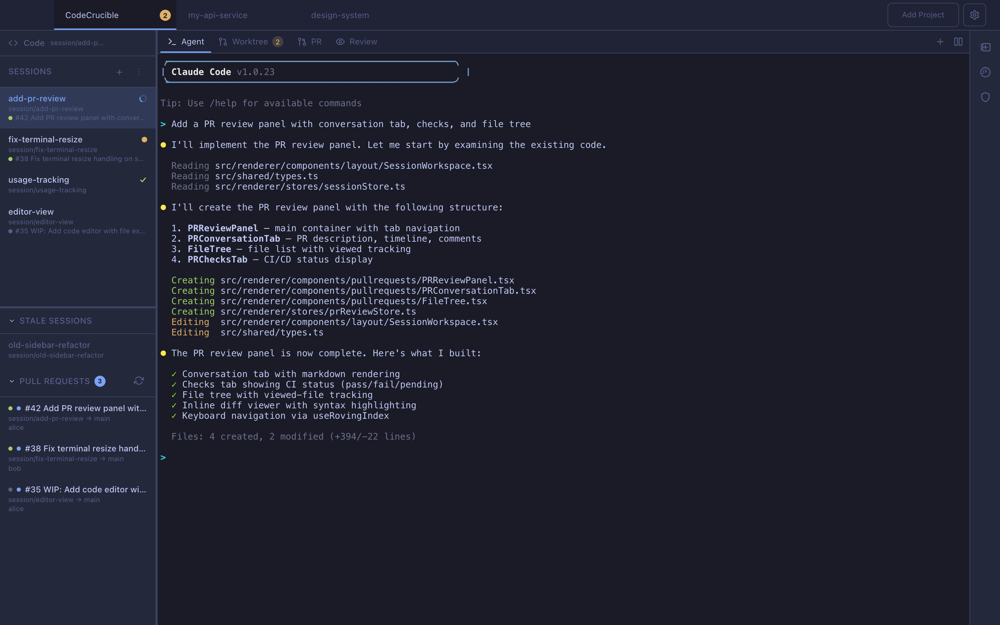
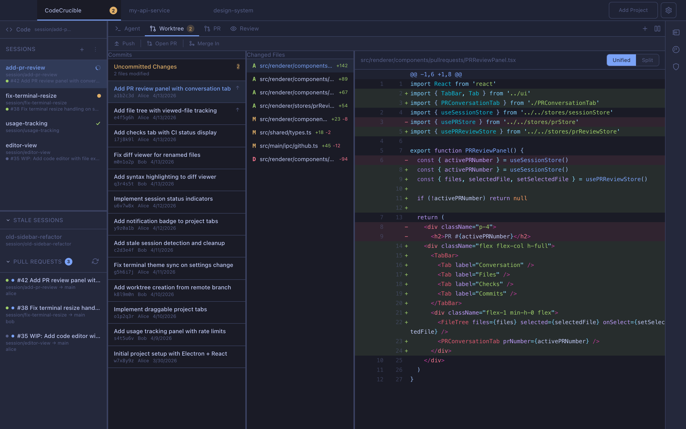
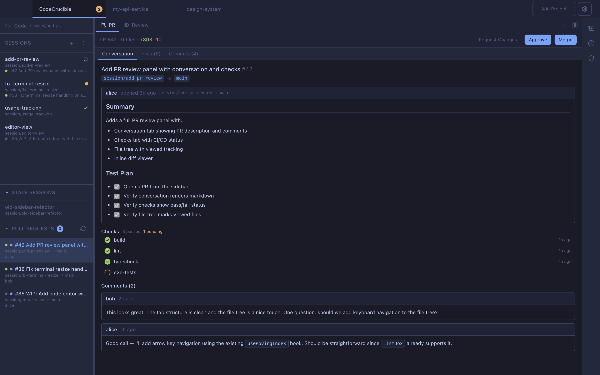
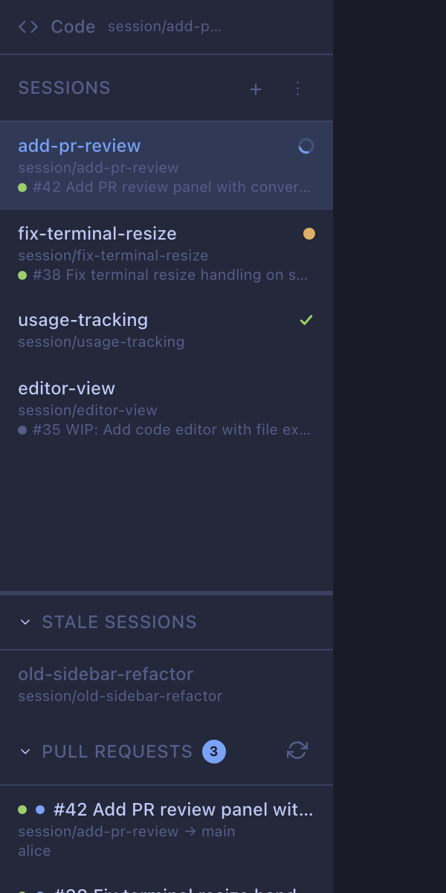
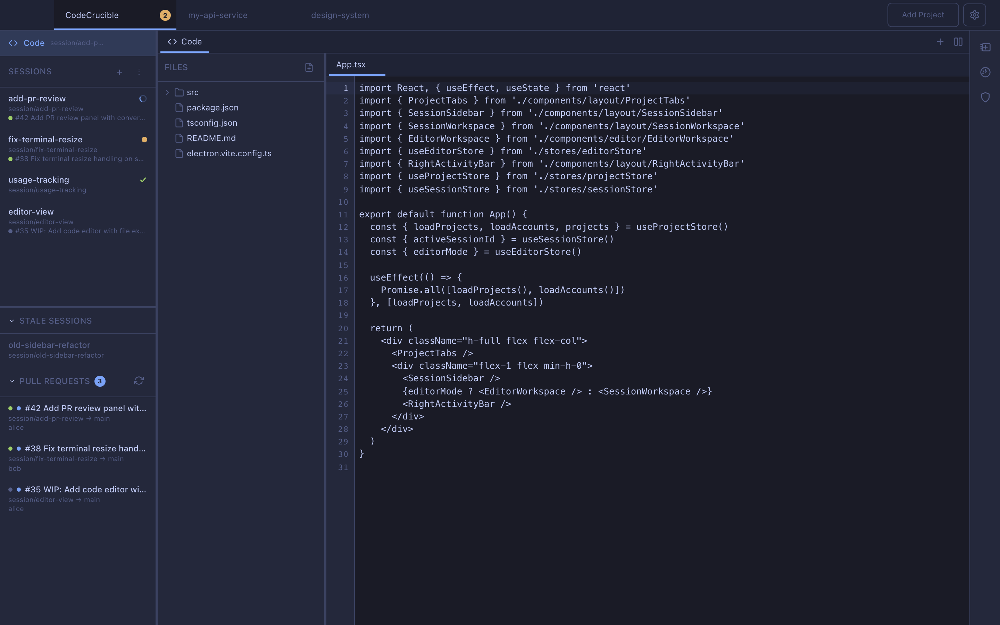
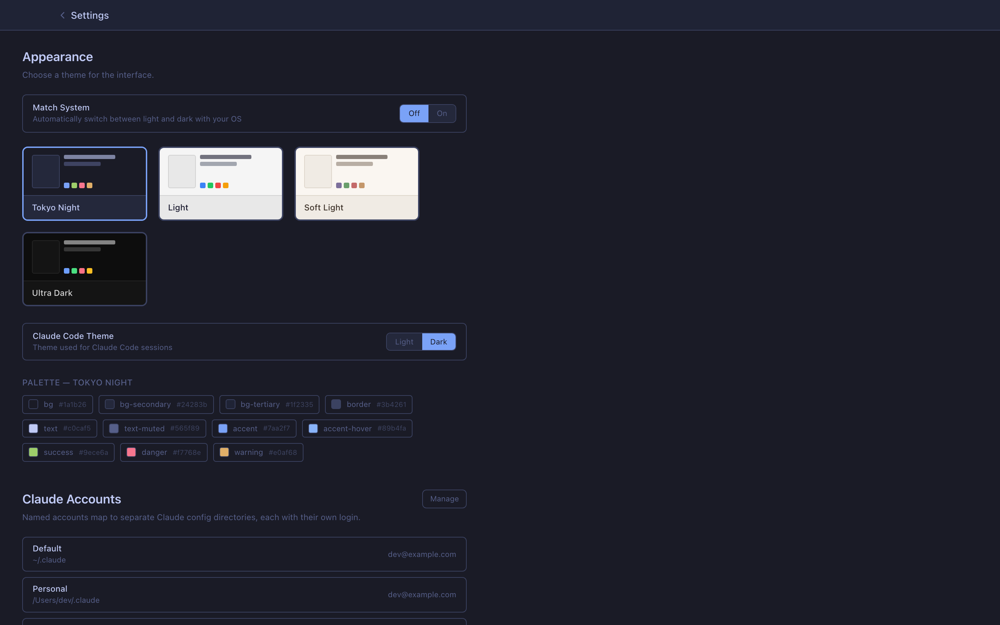
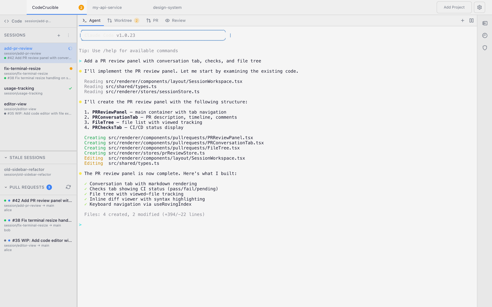

<p align="center">
  
</p>

<h1 align="center">CodeCrucible</h1>

<p align="center">
  IDE for agentic development — manage multiple Claude Code sessions in parallel, each in its own git worktree, with built-in diff viewer, PR reviews, and terminal.
</p>

<p align="center">
  <a href="LICENSE">MIT License</a> · <a href="CONTRIBUTING.md">Contributing</a>
</p>

<!-- TODO: Replace with actual screenshot -->


## Features

- **Multi-project management** — Open multiple git repos, switch with draggable tabs, per-project notifications
- **Session isolation** — Each session gets its own git worktree and branch — no conflicts between parallel agents
- **Embedded terminals** — Full xterm.js terminal per session with dynamic shell and Claude terminals
- **Git integration** — Commit log, changed files, and syntax-highlighted inline diffs (Shiki)
- **PR review panel** — Review pull requests without leaving the IDE: conversation, checks, file tree, inline comments, merge
- **Intervention alerts** — Desktop notifications and dock badge when Claude Code needs your input
- **Usage tracking** — Rate limit bars and activity stats per session
- **Code editor** — CodeMirror editor with file explorer for editing files in any worktree
- **Themes** — Dark (Tokyo Night), Light, Soft Light, and Ultra Dark — terminal theme syncs automatically
- **Keyboard navigable** — Full keyboard support: arrow keys, focus trapping, roving tabindex, accessible by default

## Visual Tour

<!-- TODO: Replace with actual screenshots -->

<table>
<tr>
<td width="50%">

**Git diff viewer**

Browse commits and view syntax-highlighted diffs inline.



</td>
<td width="50%">

**PR review**

Review pull requests with conversation, checks, file tree, and inline comments.



</td>
</tr>
<tr>
<td width="50%">

**Session management**

Sessions show live status: running (spinner), needs attention (dot), completed (check), or stale.



</td>
<td width="50%">

**Code editor**

Built-in CodeMirror editor with file explorer — edit files directly in any worktree.



</td>
</tr>
<tr>
<td width="50%">

**Settings & themes**

Four built-in themes with automatic terminal sync, account management, and preferences.



</td>
<td width="50%">

**Themes**

Dark (Tokyo Night), Light, Soft Light, and Ultra Dark.



</td>
</tr>
</table>

<details>
<summary><strong>Getting Started</strong></summary>

### Prerequisites

- Node.js 18+, npm
- A git repository to open as a project

### Dev mode

```bash
npm install
npm run dev
```

1. Click **Add Project** and select a folder containing a git repository.
2. Create a session from the sidebar — this creates a new branch and worktree.
3. Use the terminal to run `claude` or any other commands in the isolated worktree.
4. View commits and diffs in the git panel as your agent works.
5. Open PRs directly from the git panel toolbar.

### Native install (macOS arm64)

The native install runs from its own bundled assets, so switching branches in the source repo won't break the running app.

```bash
npm run dist
```

This builds and copies `Crucible Code.app` to `/Applications/`.

### Auto-update

The installed app polls `origin/main` every 5 minutes. When new commits land, an **Update Available** button appears in the title bar. Click it to pull, rebuild, and relaunch automatically.

</details>

<details>
<summary><strong>Multi-project management</strong></summary>

Open multiple git repositories as projects. Each project gets its own tab in the top bar.

- **Draggable tabs** — Reorder projects by dragging
- **Per-project state** — Active session, PR selection, and workspace layout persist when switching between projects
- **Per-project accounts** — Assign different Claude accounts to different projects for isolated billing and auth
- **Notification badges** — Tab badges show how many sessions need attention across all projects
- **Confirm close** — Closing a project tab prompts for confirmation to prevent accidental removal

</details>

<details>
<summary><strong>Sessions & worktrees</strong></summary>

Each session creates a git worktree at `<repo-parent>/.codecrucible-worktrees/<repo>/<session>/` with its own branch (`session/<name>`).

- **Create from scratch** — New branch from any base branch
- **Import existing worktree** — Bring in worktrees created outside CodeCrucible
- **Open remote branch** — Create a session from a remote branch with autocomplete
- **Open as main branch** — Temporarily check out a session's branch on the main repo (useful for builds that need the real repo path)
- **Stale detection** — Sessions whose branches are merged and inactive for 24+ hours are automatically detected and moved to a collapsible "Stale" section
- **Manual stale/reactivate** — Mark sessions as stale or bring them back

</details>

<details>
<summary><strong>Terminal management</strong></summary>

Every session gets an embedded terminal (xterm.js + node-pty) that opens in the worktree directory.

- **Auto-spawn** — A Claude terminal spawns automatically when you select a session
- **Dynamic terminals** — Add extra shell or Claude terminals from the workspace tab bar
- **Theme sync** — Terminal colors update when you change the app theme
- **Claude Code theme** — Separately configurable light/dark theme for the Claude Code CLI
- **Intervention detection** — Terminal output is scanned for permission prompts and questions, triggering notifications

</details>

<details>
<summary><strong>Git integration</strong></summary>

Built-in git panel with commit history, changed files, and diff viewer.

- **Commit log** — Scrollable list with polling for new commits
- **Changed files** — Both committed and working-tree changes
- **Syntax-highlighted diffs** — Inline diff viewer powered by Shiki with full language support
- **Commit status indicators** — Unpushed commits and new branches are marked
- **Push & PR** — Push button, open PR button, and merge controls with conflict detection
- **Working file diffs** — View uncommitted changes alongside commit diffs

</details>

<details>
<summary><strong>PR review</strong></summary>

Full pull request review without leaving the IDE.

- **Conversation tab** — PR description and timeline with markdown rendering
- **Checks tab** — CI/CD status for all checks (pass/fail/pending/in-progress)
- **Commits tab** — Individual commits in the PR with per-commit diffs
- **File tree** — All changed files with viewed-file tracking (checkmarks)
- **Scrollable diff view** — Optimized for large PRs (300+ files)
- **Inline comments** — Create review comments on specific lines
- **Submit reviews** — Approve, request changes, or comment
- **Merge** — Merge/squash/rebase with mergeability checks
- **Review threads** — View resolved and unresolved review threads

</details>

<details>
<summary><strong>Notifications & intervention detection</strong></summary>

Detects when Claude Code needs user input by scanning terminal output for permission prompts and questions.

- **Desktop notifications** — OS-level notifications when Claude needs attention
- **Dock badge** — macOS dock badge shows count of sessions needing input
- **Session status indicators** — Sidebar icons show running (spinner), attention (yellow dot), completed (green check)
- **Auto-clear** — Attention state clears when you navigate to the session
- **Cross-project** — Notification badges appear on project tabs for non-active projects too

</details>

<details>
<summary><strong>Usage tracking</strong></summary>

Monitor Claude Code usage and rate limits from the right panel.

- **Rate limit bars** — 5-hour and 7-day usage windows with visual progress bars
- **Session stats** — Cost, duration, lines added/removed per session
- **Activity chart** — Daily activity over the past week (messages, sessions, tool calls)
- **Subscription info** — Shows your current plan and rate limit tier

</details>

<details>
<summary><strong>Code editor</strong></summary>

Built-in code editor for when you need to make quick edits without switching apps.

- **CodeMirror 6** — Language support for JavaScript, TypeScript, Python, CSS, HTML, JSON, and Markdown
- **File explorer** — Directory tree for any worktree, with file watching for external changes
- **Create and rename** — Create new files, rename existing ones from the explorer
- **Toggle mode** — Switch between editor view and terminal view from the workspace

</details>

<details>
<summary><strong>Notes</strong></summary>

Per-project notes panel accessible from the right activity bar.

- Create, edit, and delete markdown notes
- Useful for tracking session goals, review checklists, or project context

</details>

<details>
<summary><strong>Permissions sync</strong></summary>

View and edit Claude Code permissions (allow/deny lists) from the right panel.

- Changes sync across all worktrees for the project
- See which tools and commands are allowed or denied at a glance

</details>

<details>
<summary><strong>Architecture</strong></summary>

Three-layer Electron architecture with strict process isolation:

```
src/
├── main/            # Electron main process (Node.js)
│   ├── ipc/         # IPC handlers (one file per domain)
│   └── services/    # Business logic (git, worktree, terminal, notification)
├── preload/         # contextBridge — typed API on window.api
├── renderer/        # React UI (no Node.js access)
│   ├── components/
│   │   ├── ui/           # Base components (Button, Dialog, ListBox, TabBar, etc.)
│   │   ├── layout/       # App shell (ProjectTabs, SessionSidebar, SessionWorkspace)
│   │   ├── sessions/     # Session management (SessionCard, CreateSessionDialog)
│   │   ├── git/          # Git viewer (CommitList, ChangedFiles, DiffViewer)
│   │   ├── terminal/     # Terminal (TerminalPanel, DynamicTerminalPanel)
│   │   ├── editor/       # Code editor (CodeEditorPanel, FileExplorer)
│   │   ├── pullrequests/ # PR review (PRReviewPanel, PRConversationTab, FileTree)
│   │   ├── notes/        # Notes panel
│   │   ├── usage/        # Usage tracking panel
│   │   ├── permissions/  # Permissions panel
│   │   └── settings/     # Settings page
│   ├── stores/      # Zustand state (14 stores)
│   ├── hooks/       # Shared hooks (useResizable, useFocusTrap, useRovingIndex)
│   └── styles/      # Tailwind + CSS custom property themes
└── shared/          # Types, constants, patterns shared across processes
```

### Tech stack

- **Runtime**: Electron 33 (main + renderer)
- **UI**: React 19, TypeScript, Tailwind CSS 4
- **Build**: electron-vite 5, Vite 8
- **State**: Zustand (14 stores)
- **Terminal**: xterm.js + node-pty
- **Git**: simple-git
- **Syntax highlighting**: Shiki
- **Code editor**: CodeMirror 6
- **Markdown**: marked

### IPC

All communication between renderer and main process goes through typed IPC channels defined in `src/shared/constants.ts`. The renderer has no Node.js access — it communicates exclusively via `window.api`, exposed by the preload script with `contextIsolation: true`.

</details>

<details>
<summary><strong>Theming</strong></summary>

Four built-in themes: **Dark** (Tokyo Night, default), **Light**, **Soft Light**, and **Ultra Dark**.

Themes are defined as CSS custom properties in `src/renderer/styles/globals.css`. Tailwind utilities reference these properties via the `@theme` block, so switching themes is instant and all components respond automatically.

Terminal colors sync with the app theme. The Claude Code CLI theme (light/dark) can be configured separately in settings.

To add a custom theme, add a `[data-theme="your-theme"]` block with the same property names:

```css
[data-theme="your-theme"] {
  --color-bg: #...;
  --color-text: #...;
  --color-accent: #...;
  /* see globals.css for the full list */
}
```

</details>

<details>
<summary><strong>Keyboard shortcuts</strong></summary>

| Key | Action |
|-----|--------|
| Arrow Up/Down | Navigate lists (sessions, commits, files) |
| Arrow Left/Right | Navigate tabs |
| Enter / Space | Activate selection |
| Escape | Close dialogs, settings, panels |
| Tab | Standard focus navigation |

All interactive elements use `focus-visible` rings — visible on keyboard navigation, hidden on mouse clicks.

</details>

## Contributing

See [CONTRIBUTING.md](CONTRIBUTING.md). The short version: PR descriptions should explain the **intent and prompt** behind the change, not just the code. Features are accepted based on whether the aim fits the project.

## License

[MIT](LICENSE) — do whatever you want with it.
