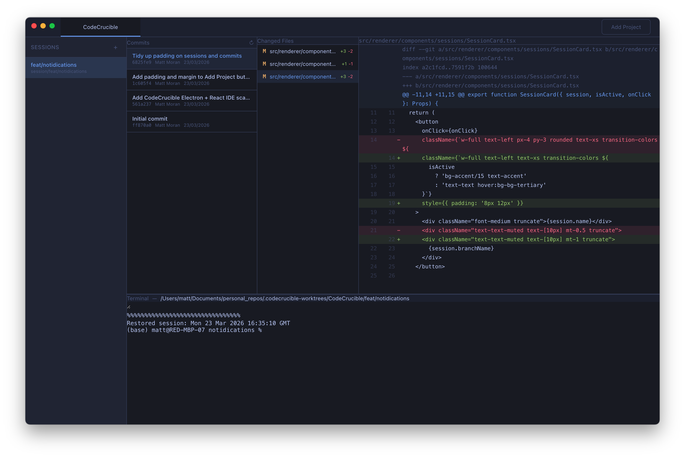

<p align="center">
  
</p>

<h1 align="center">CodeCrucible</h1>

<p align="center">
  An IDE for agentic development. Manage multiple Claude Code sessions in parallel, each in its own git worktree, with a built-in diff viewer and terminal.
</p>

<p align="center">
  <a href="LICENSE">MIT License</a> · <a href="CONTRIBUTING.md">Contributing</a>
</p>



## Features

- **Multiple projects** — Open any git repository as a project. Switch between them with tabs.
- **Sessions** — Each session creates a git worktree with its own branch. Run independent Claude Code agents side by side without conflicts.
- **Embedded terminal** — Full terminal opens in the session's worktree directory. Launch Claude Code and work directly.
- **Intervention notifications** — Desktop notifications when Claude Code needs your input (permission prompts, questions). Optional Slack integration for remote responses.
- **Git diff viewer** — Browse commits, see changed files, and view inline diffs — like GitHub Desktop, built into the IDE.
- **Keyboard navigable** — Full keyboard support throughout: arrow keys for lists and tabs, Escape to close dialogs, focus trapping in modals.
- **Themeable** — Dark (Tokyo Night), Light, and Ultra Dark themes. Add your own with a single CSS block.

<details>
<summary><strong>Getting Started</strong></summary>

### Dev mode

```bash
npm install
npm run dev
```

1. Click **Add Project** and select a folder containing a git repository.
2. Create a session from the sidebar — this creates a new branch and worktree.
3. Use the terminal to run `claude` or any other commands in the isolated worktree.
4. View commits and diffs in the git panel as your agent works.

### Native install (macOS arm64)

The native install runs from its own bundled assets, so switching branches in the source repo won't break the running app.

```bash
npm run dist
cp -R dist-electron/mac-arm64/CodeCrucible.app /Applications/
open /Applications/CodeCrucible.app
```

The installed app polls `origin/main` every 5 minutes. When new commits land, an **Update Available** button appears in the title bar. Click it to pull, rebuild, and relaunch automatically.

</details>

<details>
<summary><strong>Architecture</strong></summary>

Three-layer Electron architecture with strict process isolation:

```
src/
├── main/        # Electron main process (Node.js)
│   ├── ipc/     # IPC handlers (one file per domain)
│   └── services/# Business logic (git, worktree, terminal)
├── preload/     # contextBridge — typed API on window.api
├── renderer/    # React UI (no Node.js access)
│   ├── components/
│   │   ├── ui/       # Base components (Button, Dialog, ListBox, etc.)
│   │   ├── layout/   # App shell
│   │   ├── sessions/ # Session management
│   │   ├── git/      # Diff viewer
│   │   └── terminal/ # Terminal panel
│   ├── stores/  # Zustand state (project, session, terminal, git)
│   └── styles/  # Tailwind + theme definitions
└── shared/      # Types and constants shared across processes
```

### Tech stack

- **Runtime**: Electron 33 (main + renderer)
- **UI**: React 19, TypeScript, Tailwind CSS 4
- **Build**: electron-vite 5
- **State**: Zustand
- **Terminal**: xterm.js + node-pty
- **Git**: simple-git
- **Syntax highlighting**: Shiki

</details>

<details>
<summary><strong>Theming</strong></summary>

Three built-in themes: **Dark** (Tokyo Night, default), **Light**, and **Ultra Dark**.

Themes are defined as CSS custom properties in `src/renderer/styles/globals.css`. Tailwind utilities reference these properties, so switching themes is instant.

To add a custom theme, add a `[data-theme="your-theme"]` block with the same property names:

```css
[data-theme="your-theme"] {
  --color-bg: #...;
  --color-text: #...;
  --color-accent: #...;
  /* see globals.css for the full list */
}
```

</details>

<details>
<summary><strong>Slack Integration</strong></summary>

Get notified in Slack when Claude needs permission to run a tool, and approve or deny directly from your phone — no need to be at your machine.

When enabled, Claude Code's `PreToolUse` hook sends permission requests to a Slack channel with **Allow** / **Deny** buttons. Claude blocks until you respond (up to 10 minutes). If Slack is not connected, the normal interactive terminal prompt is shown instead.

### Setup

1. Go to [api.slack.com/apps](https://api.slack.com/apps) and create a new app **From scratch**
2. Under **Socket Mode**, enable it and generate an app-level token (starts with `xapp-`)
3. Under **OAuth & Permissions**, add the `chat:write` bot scope
4. Under **Interactivity & Shortcuts**, toggle Interactivity on
5. Install the app to your workspace — copy the **Bot User OAuth Token** (starts with `xoxb-`)
6. Invite the bot to your channel: `/invite @YourAppName`
7. In CodeCrucible, open **Settings** → **Slack Notifications**
8. Toggle on, paste the bot token, app-level token, and channel ID
9. Click **Save & Connect**, then **Test Message** to verify

### How it works

```
Claude wants to use Bash("npm test")
  → PreToolUse hook fires
  → Permission request sent to Slack with [Allow] [Deny] buttons
  → You tap Allow on your phone
  → Claude proceeds
```

Tokens are stored securely in the app's data directory, never in the renderer or localStorage. The `PreToolUse` hook is only added to session configs when Slack is connected — otherwise Claude's normal permission prompts are used.

</details>

## Contributing

See [CONTRIBUTING.md](CONTRIBUTING.md). The short version: PR descriptions should explain the **intent and prompt** behind the change, not just the code. Features are accepted based on whether the aim fits the project.

## License

[MIT](LICENSE) — do whatever you want with it.
