<p align="center">
  
</p>

<h1 align="center">CodeCrucible</h1>

<p align="center">
  IDE for agentic development — manage multiple Claude Code sessions in parallel, each in its own git worktree, with built-in diff viewer, PR reviews, and terminal.
</p>

<p align="center">
  <a href="LICENSE">MIT License</a> · <a href="CONTRIBUTING.md">Contributing</a>
</p>

<!-- TODO: Replace with actual screenshot -->
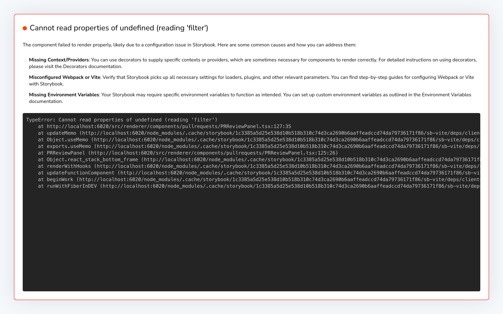

## Features

- **Multi-project management** — Open multiple git repos, switch with draggable tabs, per-project notifications
- **Session isolation** — Each session gets its own git worktree and branch — no conflicts between parallel agents
- **Embedded terminals** — Full xterm.js terminal per session with dynamic shell and Claude terminals
- **Git integration** — Commit log, changed files, and a GitHub-style syntax-highlighted diff viewer (Shiki) with full-file syntax context, click-anywhere context expansion, per-hunk collapse, and side-by-side or unified modes
- **PR review panel** — Review pull requests without leaving the IDE: conversation, checks, file tree, inline comments, merge
- **Intervention alerts** — Desktop notifications and dock badge when Claude Code needs your input
- **Usage tracking** — Rate limit bars and activity stats per session
- **Code editor** — CodeMirror editor with file explorer for editing files in any worktree
- **Themes** — Dark (Tokyo Night), Light, Soft Light, and Ultra Dark — terminal theme syncs automatically
- **Remote access** — Pair a second device's browser to your desktop instance over the LAN, or over a hosted end-to-end encrypted Cloudflare Worker relay that works through VPNs and hotel Wi-Fi. View projects, sessions, settings, and live agent terminals from anywhere (full mobile layout, PWA-installable on iOS)
- **Custom buttons** — Configurable action buttons that run shell commands or Claude prompts with placement, scope, and shortcut options
- **Session startup prompts** — Pre-configure per-project prompts (e.g. `/notion-ticket {{input}}`) that auto-run in a new session's agent terminal
- **Review loop** — One-click review → triage → fix cycle on a branch. Runs headless in the background by default (`claude -p`, no terminal — the panel streams each transcript), or flip a per-project toggle to run it as three live Claude Code terminals you can watch and steer. Stop conditions (clean rounds, iteration cap) and a sticky PR comment for skipped findings
- **Foundry** — Run a whole Notion backlog on autopilot. An interactive foreman Claude plans dependencies; multiple worker sessions run in parallel; each pipeline goes implement → draft PR → review loop → ready. Human reviews code and tests; everything else is automated. See [docs/FOUNDRY.md](docs/FOUNDRY.md)
- **Local PRs** — A staging stage between a draft branch and an open GitHub PR. Snapshot any session into a viewable, reviewable local PR (or let capture mode intercept the agent's `gh pr create`), then **Promote** it to a real PR. In local-PR mode Foundry builds a chained stack overnight that you publish in one click with **Create PRs** (open → optional local CI → fix-on-failure → ready, in order)
- **Claude Web sessions** — Surface your own `claude/*` branches from Claude Code on the web in the sidebar; click to open them locally as worktrees
- **Keyboard navigable** — Full keyboard support: arrow keys, focus trapping, roving tabindex, accessible by default

## Visual Tour

<!-- TODO: Replace with actual screenshots -->

<table>
<tr>
<td width="50%">

**Git diff viewer**

Browse commits and view syntax-highlighted diffs inline.


</td>
<td width="50%">

**PR review**

Review pull requests with conversation, checks, file tree, and inline comments.

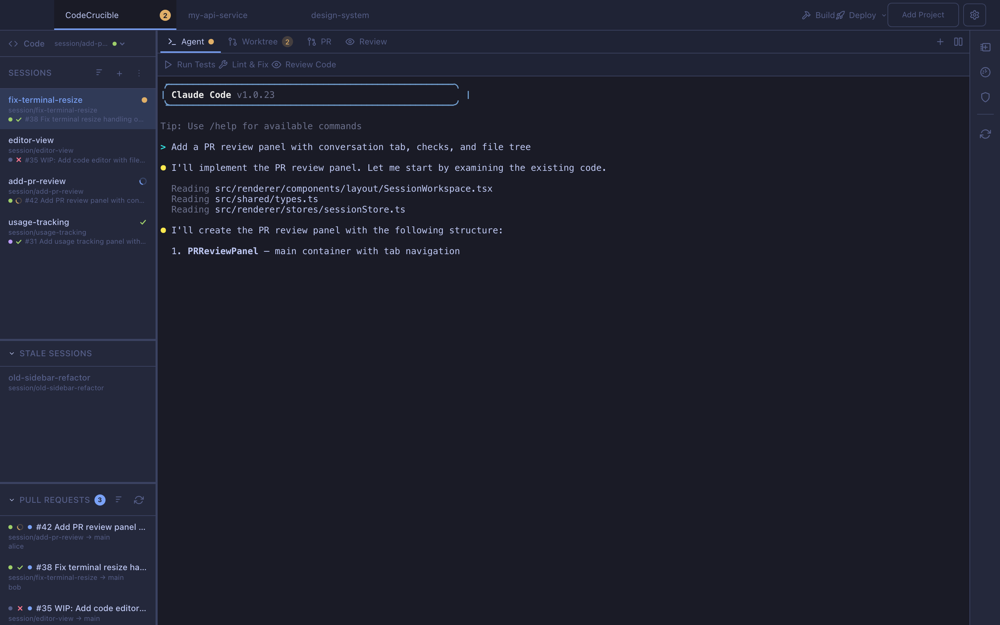

</td>
</tr>
<tr>
<td width="50%">

**Session management**

Sessions show live status: running (spinner), needs attention (dot), or completed (check).

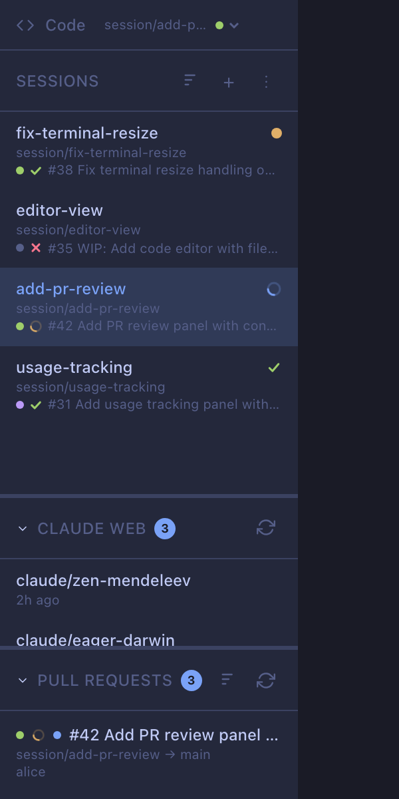

</td>
<td width="50%">

**Code editor**

Built-in CodeMirror editor with file explorer — edit files directly in any worktree.

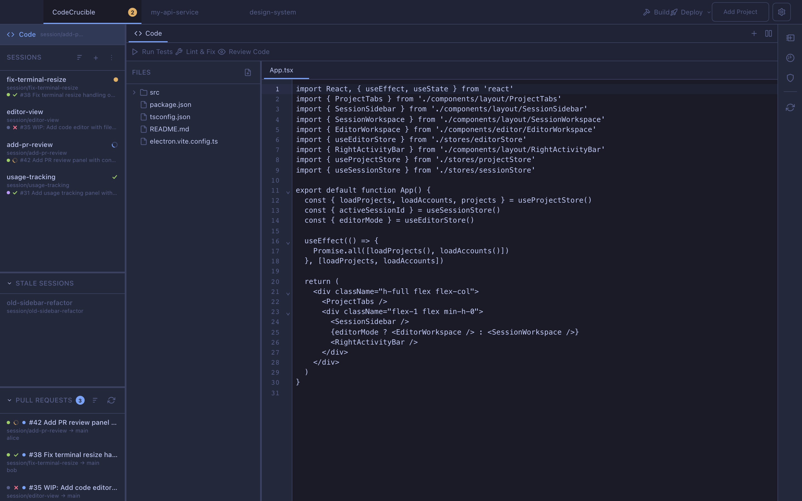

</td>
</tr>
<tr>
<td width="50%">

**Custom buttons**

Add configurable action buttons to the toolbar, top bar, or right sidebar.

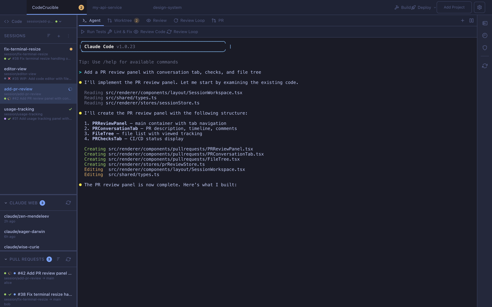

</td>
<td width="50%">

**Button settings**

Full settings UI for creating, editing, and organizing custom buttons.

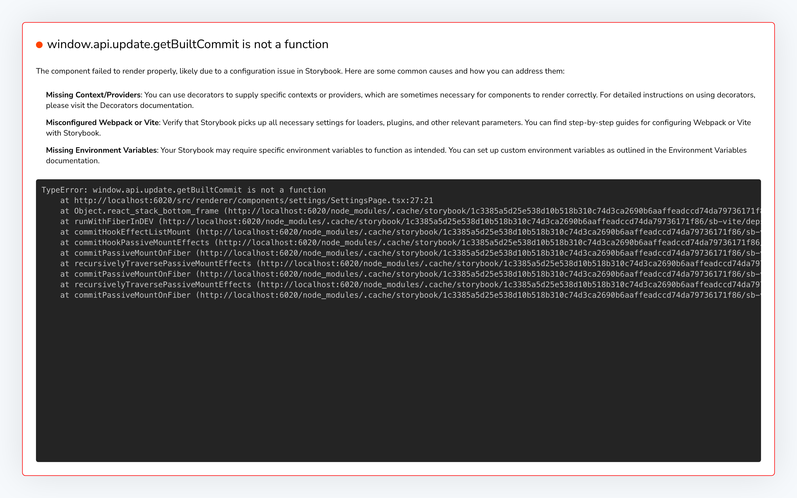

</td>
</tr>
<tr>
<td width="50%">

**Settings & themes**

Four built-in themes with automatic terminal sync, account management, and preferences.


</td>
<td width="50%">

**Themes**

Dark (Tokyo Night), Light, Soft Light, and Ultra Dark.

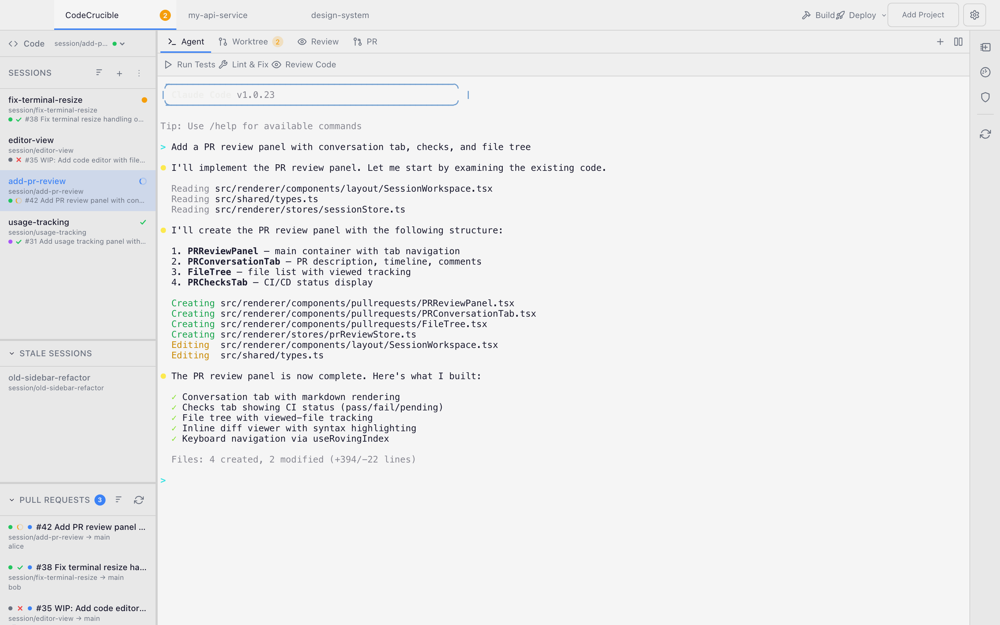

</td>
</tr>
</table>

<details>
<summary><strong>Getting Started</strong></summary>

### Prerequisites

- Node.js 18+, npm
- A git repository to open as a project

### Dev mode

```bash
npm install
npm run dev
```

1. Click **Add Project** and select a folder containing a git repository.
2. Create a session from the sidebar — this creates a new branch and worktree.
3. Use the terminal to run `claude` or any other commands in the isolated worktree.
4. View commits and diffs in the git panel as your agent works.
5. Open PRs directly from the git panel toolbar.

### Native install (macOS arm64)

The native install runs from its own bundled assets, so switching branches in the source repo won't break the running app.

```bash
npm run dist
```

This builds and copies `Crucible Code.app` to `/Applications/`.

### Auto-update

The installed app polls `origin/main` every 5 minutes. When new commits land, an **Update Available** button appears in the title bar. Click it to pull, rebuild, and relaunch automatically.

</details>

<details>
<summary><strong>Remote access (web receiver)</strong></summary>

Pair a second device's browser to your desktop in one of two modes. Both serve the same React receiver — same projects, sessions, settings, live agent terminals. Architecture details live in [docs/REMOTE.md](docs/REMOTE.md); the cloud relay deep-dive is in [docs/cloud-relay.md](docs/cloud-relay.md).

| | LAN mode | Cloud mode |
|---|---|---|
| Transport | Embedded WebSocket server on the desktop | Outbound WSS to a hosted Cloudflare Worker relay |
| Requires same network | Yes | No — works through VPN, cellular, hotel Wi-Fi |
| Third party in path | None | Relay (forwards opaque ciphertext only) |
| Encryption | TLS to the LAN listener | TLS + libsodium end-to-end (X25519 + XChaCha20-Poly1305) |
| URL on the phone | `https://<desktop-ip>:<port>` | `https://codecrucible-relay.mattmoran56.workers.dev` |

### LAN mode

Flip the LAN toggle in the desktop top-bar popover. The phone loads the receiver from the desktop and pairs with a 6-char code (single-use, 5-minute TTL); the browser swaps it for a long-lived token stored in `localStorage`.

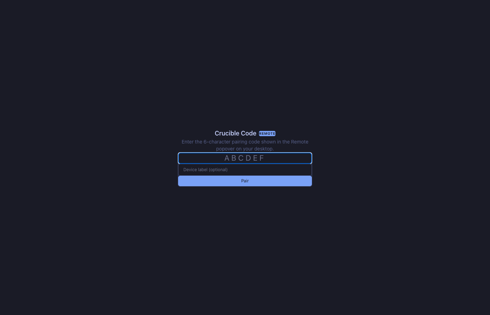
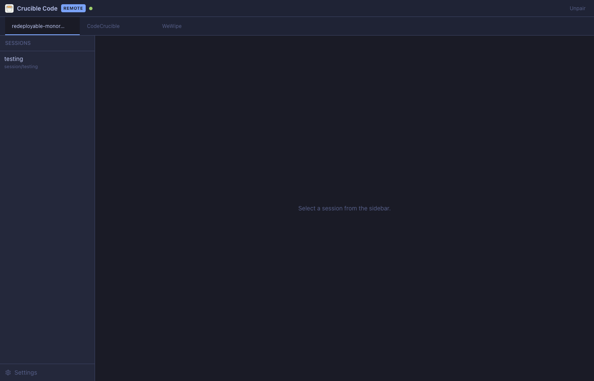
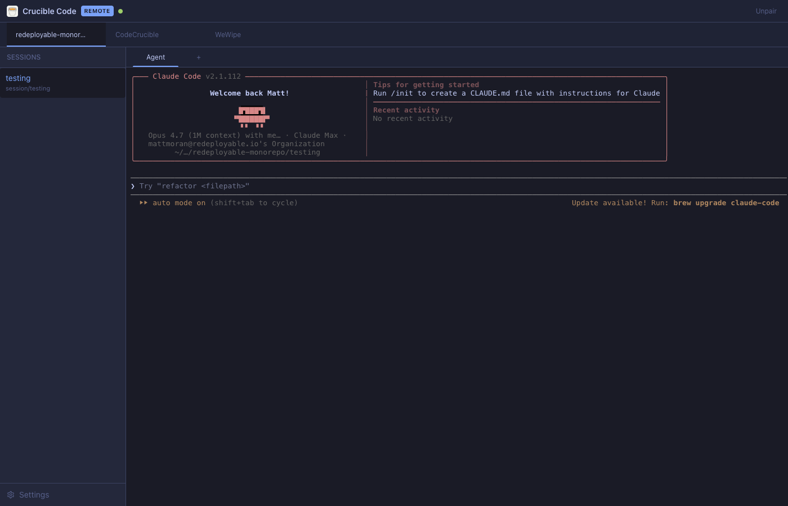

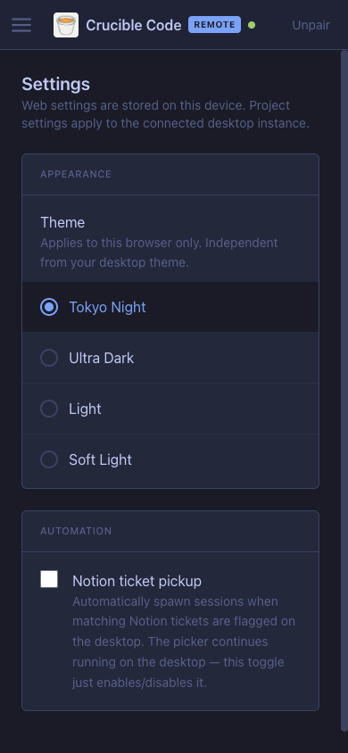

### Cloud mode

Flip **Cloud relay** on in the same popover. The desktop opens an outbound WSS to the hosted relay and registers a handle (e.g. `silver-otter-79`). On the phone, open `https://codecrucible-relay.mattmoran56.workers.dev`, type the handle and 6-char pairing code shown in the popover, and you're paired. On iOS you can install the page via Safari → Share → **Add to Home Screen** to get a standalone PWA with manifest, service worker, notch padding, and sticky tabs.

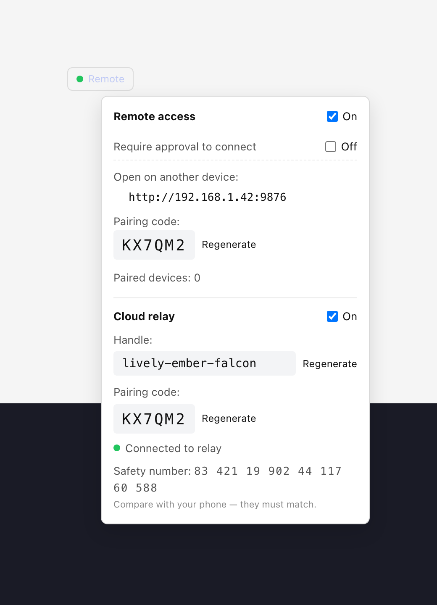
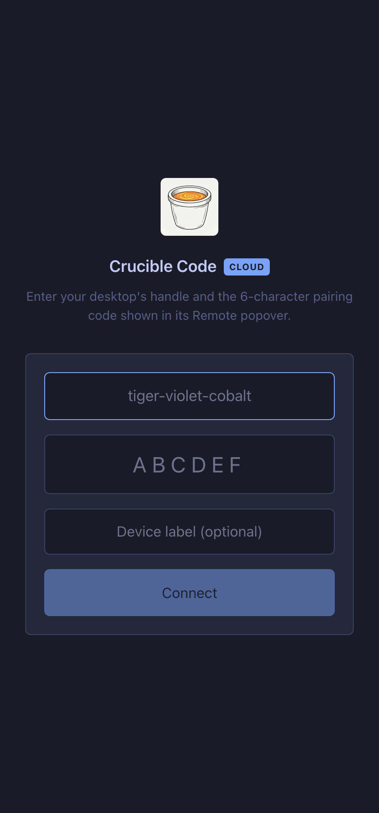

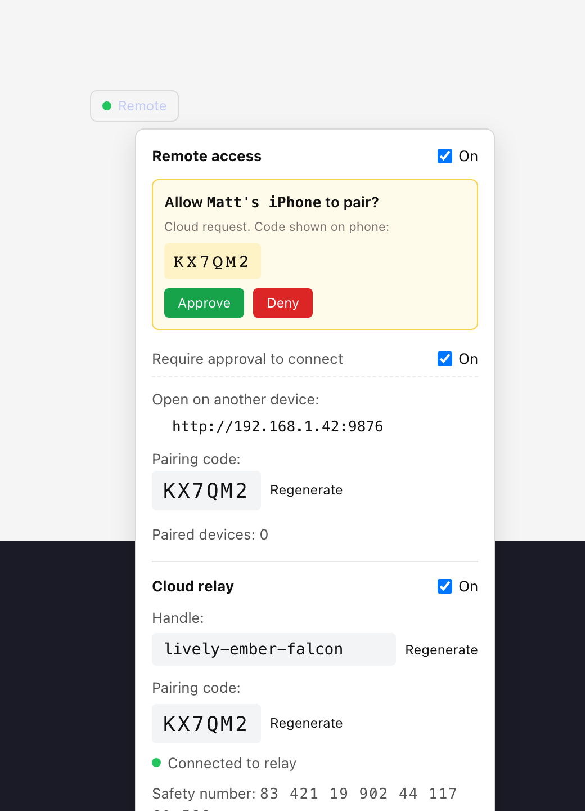

### Security model

End-to-end encrypted in both modes. Cloud mode adds a libsodium handshake on top of TLS: ephemeral X25519 key exchange, HKDF salted with the pairing code (first pair) or bearer token (reconnect), then XChaCha20-Poly1305 on every frame. A 6-digit **safety number** derived from the shared key is displayed on both ends so the user can visually confirm there's no MITM. The relay forwards opaque ciphertext only — it never sees the pairing code, IPC payloads, or terminal output. An optional **approval gate** on the desktop requires the user to Approve or Deny each incoming pairing attempt, closing brute-force of the derived ticket as an attack class. The relay layer adds KV-gated handles (no enumeration), per-IP rate limits on `/register` and `/phone`, and 30-day TTL cleanup of idle handles. Full threat model in [docs/cloud-relay.md](docs/cloud-relay.md).

### Implementation notes

- **Same code paths as the desktop renderer** — `req` frames hit the shared `handlerMap` that `ipcMain.handle` registers, so the relay can never drift from the local UI for the channels it forwards.
- **Live terminal attach with backfill** — Receiver attaches to the *existing* PTY for `(sessionId, tabId)`; the desktop's `terminal.service` keeps a 64 KiB tail per terminal so a remote join shows recent context, then streams new output live. Typing on either device drives the same shell.
- **Mobile layout** — Below 768 px the project tabs collapse into a slide-in drawer, the workspace tab strip grows to thumb-friendly h-14 with full-width accent bar, and the theme picker moves into Settings as a chunky radio list (web-only, independent from the desktop).
- **Out of v1 scope** — Pull requests, Claude-for-Web, env-var sync, and repo cloning to the remote machine.

### Self-hosting the relay

The Worker source is in [`relay-worker/`](relay-worker/README.md) — `npx wrangler deploy` puts it on your own Cloudflare account. Point the desktop at it by setting `RELAY_BACKEND_URL=https://your-relay.example.workers.dev` before launching the app.

</details>

<details>
<summary><strong>Multi-project management</strong></summary>

Open multiple git repositories as projects. Each project gets its own tab in the top bar.

- **Draggable tabs** — Reorder projects by dragging
- **Per-project state** — Active session, PR selection, and workspace layout persist when switching between projects
- **Per-project accounts** — Assign different Claude accounts to different projects for isolated billing and auth
- **Notification badges** — Tab badges show how many sessions need attention across all projects
- **Confirm close** — Closing a project tab prompts for confirmation to prevent accidental removal

</details>

<details>
<summary><strong>Sessions & worktrees</strong></summary>

Each session creates a git worktree at `<repo-parent>/.codecrucible-worktrees/<repo>/<session>/` with its own branch (`session/<name>`).

- **Create from scratch** — New branch from any base branch
- **Cmd+N shortcut** — Opens the New Session dialog from anywhere in the app
- **Auto-focus the new agent** — Once the session is created, the agent terminal grabs focus so you can start typing immediately
- **Import existing worktree** — Bring in worktrees created outside CodeCrucible
- **Open remote branch** — Create a session from a remote branch with autocomplete
- **Open as main branch** — Temporarily check out a session's branch on the main repo (useful for builds that need the real repo path)
- **Rename a session** — Give a session a more identifiable name from the card's `⋯` menu; the underlying git branch is renamed to match

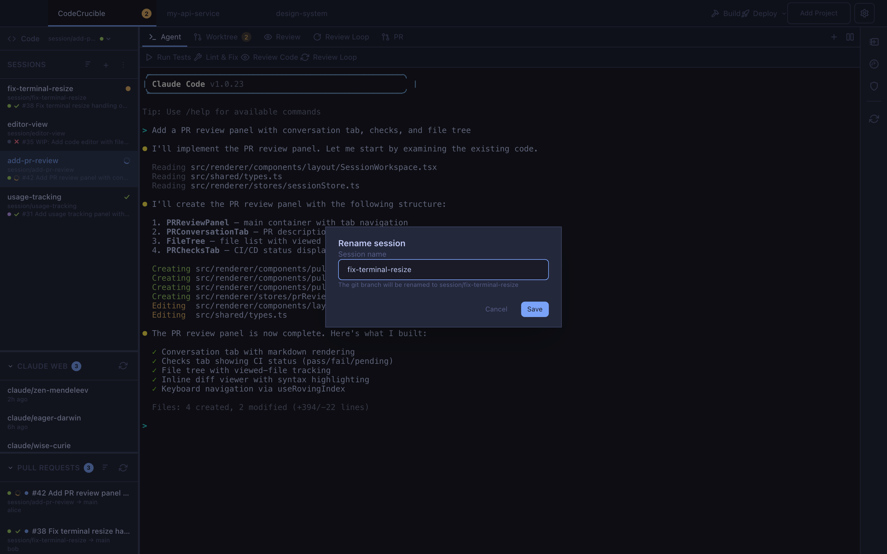

</details>

<details>
<summary><strong>Session startup prompts</strong></summary>

Configure per-project prompts that can be optionally auto-run in a new session's agent terminal. Pick one when creating a session — it's typed into the agent as soon as Claude is ready.

- **Per-project list** — Each project gets its own set of prompts, configured in Settings → Session Startup Prompts
- **Slash commands or freeform** — Use Claude slash commands (`/notion-ticket`, `/run-tests`) or any freeform prompt
- **Optional input** — Use `{{input}}` in the command to ask the user for a value (e.g. a ticket URL) when creating the session
- **None by default** — Picking nothing keeps the existing behavior; the dialog only shows the picker when prompts are configured for the project

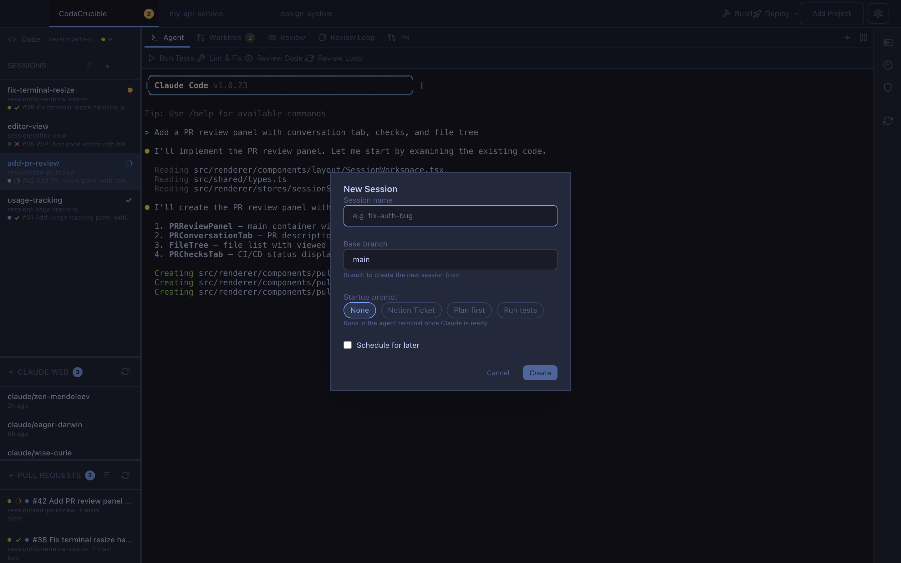
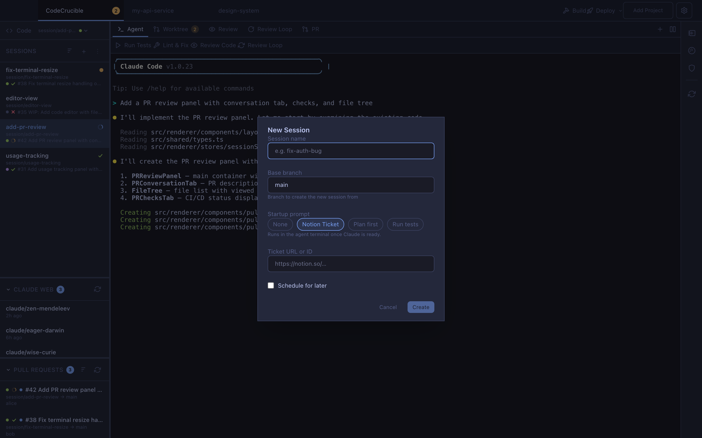
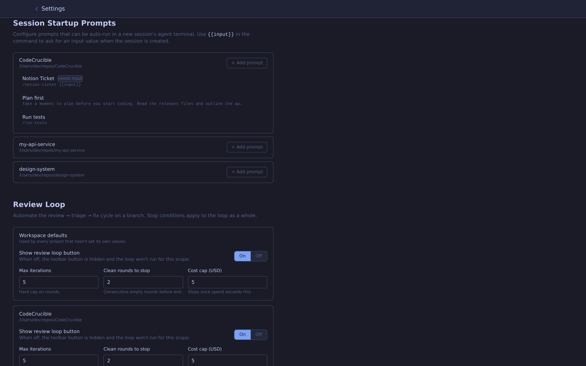
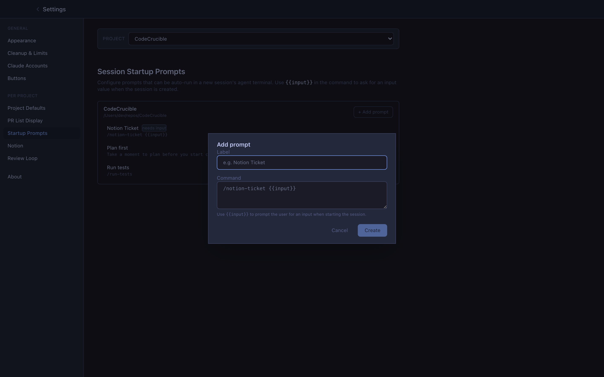

</details>

<details>
<summary><strong>Terminal management</strong></summary>

Every session gets an embedded terminal (xterm.js + node-pty) that opens in the worktree directory.

- **Auto-spawn** — A Claude terminal spawns automatically when you select a session
- **Dynamic terminals** — Add extra shell or Claude terminals from the workspace tab bar
- **Theme sync** — Terminal colors update when you change the app theme
- **Claude Code theme** — Separately configurable light/dark theme for the Claude Code CLI
- **Intervention detection** — Terminal output is scanned for permission prompts and questions, triggering notifications

</details>

<details>
<summary><strong>Git integration</strong></summary>

Built-in git panel with commit history, changed files, and a GitHub-style diff viewer.

- **Commit log** — Scrollable list with polling for new commits
- **Changed files** — Both committed and working-tree changes, with right-click stage / unstage / stash / discard / reveal in Finder
- **GitHub-style diff viewer** — Three-zone rows (gutter / indicator / body) with tabular line numbers and progressive tinting so changes pop without overwhelming the surrounding context
- **Unified or side-by-side** — Toggle between the two modes per file; choice sticks across files
- **Full-file syntax context** — Syntax highlighting (Shiki) splices the visible hunk back into the whole-file blob before tokenising, so hunks that start mid-class or mid-string still highlight correctly
- **Click-anywhere context expansion** — The "Show N unchanged lines" strip is one big click target; the discrete ↑20 / ↓20 / ⇕all buttons override that default for fine-grained control. Works in both the worktree diff and PR diff.
- **Per-hunk collapse** — Click any `@@` row to fold a hunk; "Collapse hunks" toggle in the diff header collapses every hunk in the file
- **Commit status indicators** — Unpushed commits and new branches are marked
- **Push & PR** — Push button, open PR button, and merge controls with conflict detection
- **Working file diffs** — View uncommitted changes alongside commit diffs

<table>
<tr>
<td>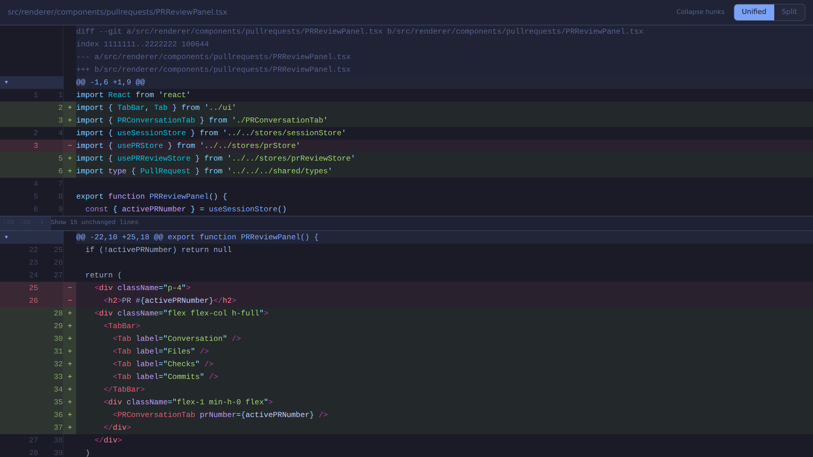</td>
<td>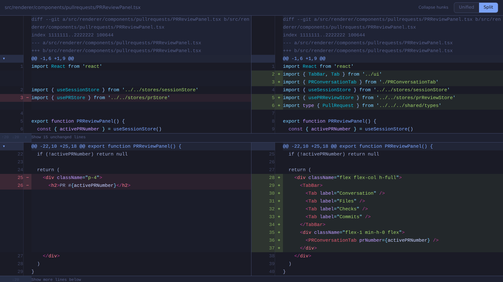</td>
</tr>
<tr>
<td>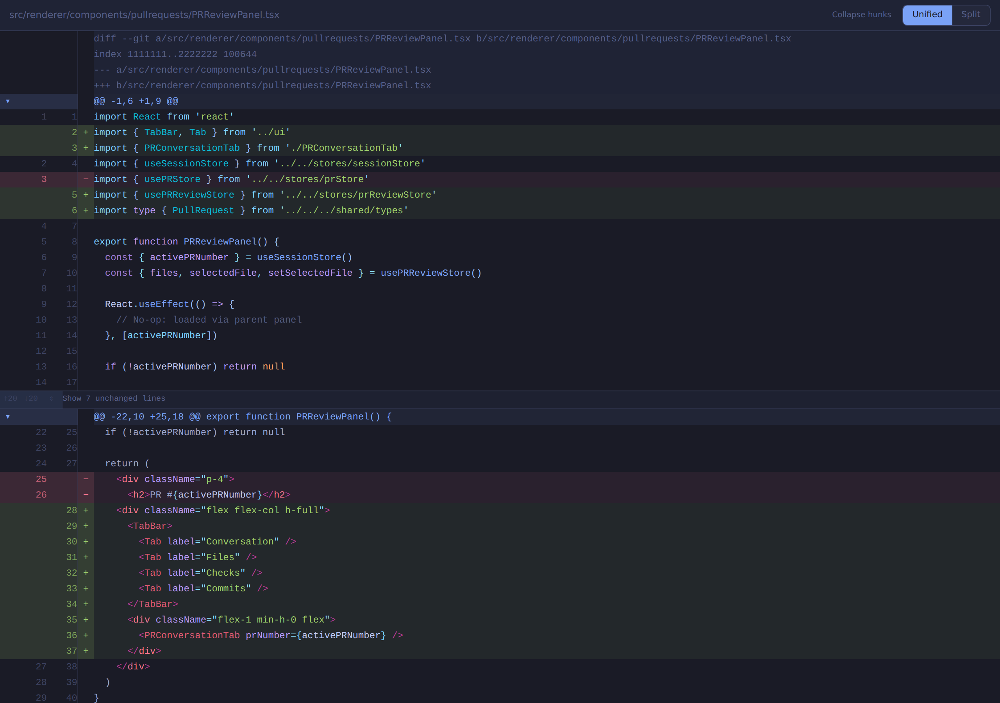</td>
<td>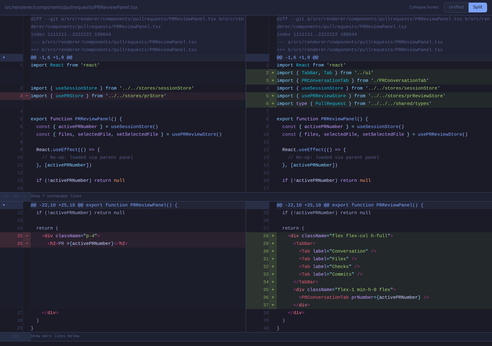</td>
</tr>
</table>

</details>

<details>
<summary><strong>PR review</strong></summary>

Full pull request review without leaving the IDE — comparable to GitHub's web UI for the day-to-day review loop.

- **Opens in its own worktree** — Clicking a PR creates a worktree at `<repo-parent>/.codecrucible-worktrees/<repo>/pr-<n>/` (via `gh pr checkout`, so forks work too) rather than swapping the main repo onto the PR branch. The main repo's branch is left alone. The worktree is reused if you click the same PR again, and torn down automatically once the PR is merged, closed, or disappears upstream
- **Conversation tab** — PR description, timeline, and CI checks with markdown rendering
- **Reviewers** — Approved / Changes requested / Awaiting review groupings, plus a typeahead "Request review" picker
- **Header summary** — At-a-glance "X approved · Y changes requested · Z pending" pill in the toolbar
- **Commits tab** — Per-commit diffs with prev/next navigation
- **File tree** — Changed files with viewed-file tracking and unresolved-comment badges
- **Scrollable diff view** — Lazy-loaded per file, optimised for very large PRs
- **Click-anywhere context expansion** — The "Show N unchanged lines" strip between hunks is one big click target (defaults to expand-all for a known gap, expand-down for a tail). The discrete ↑20 / ↓20 / ⇕all buttons inside the strip override that default for fine-grained control. Surrounding lines are pulled from the head SHA.
- **Per-hunk collapse** — Click any `@@` row to fold a hunk; "Collapse hunks" toggle in the diff header collapses every hunk in the file
- **Inline threads** — Reply to and resolve / unresolve review threads inline; resolved threads collapse to one line
- **Suggestion blocks** — `` ```suggestion `` blocks render as a side-by-side preview with an Apply button that writes to the worktree and creates a commit
- **Submit reviews** — Approve, request changes, or leave a comment
- **Merge** — Merge / squash / rebase with mergeability checks
- **Sidebar sort & filter** — Per-repo sort (PR number, recently updated, recently created) and filters (status, assignee, author, review-requested, CI status, unseen-only). "Me" pinned at the top of every person picker so the common case is one click
- **Sidebar display options** — Per-project control over which fields each PR card shows. Toggle the existing fields (state, CI, badges, branches, author) plus labels (with all/only-selected filter), requested reviewers, reviewer states, assignees, comments count, and updated time. An editable default applies to projects without overrides; per-project cards show a "Customized" pill and a Reset to default button

<table>
<tr>
<td>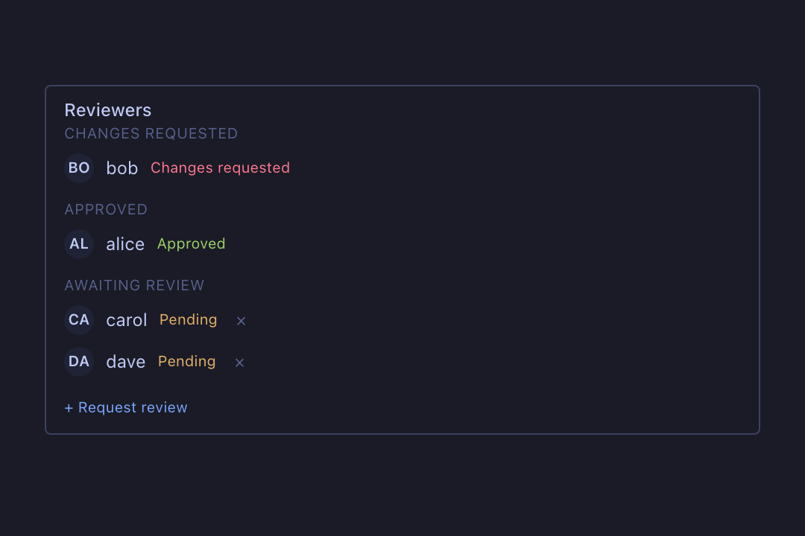</td>
<td>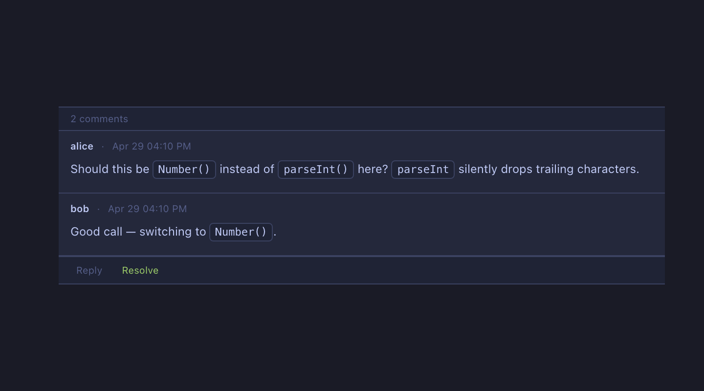</td>
</tr>
<tr>
<td>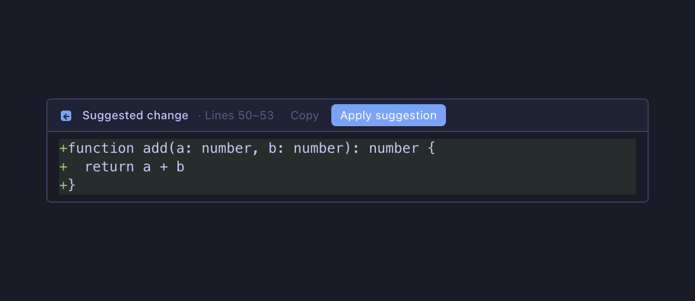</td>
<td>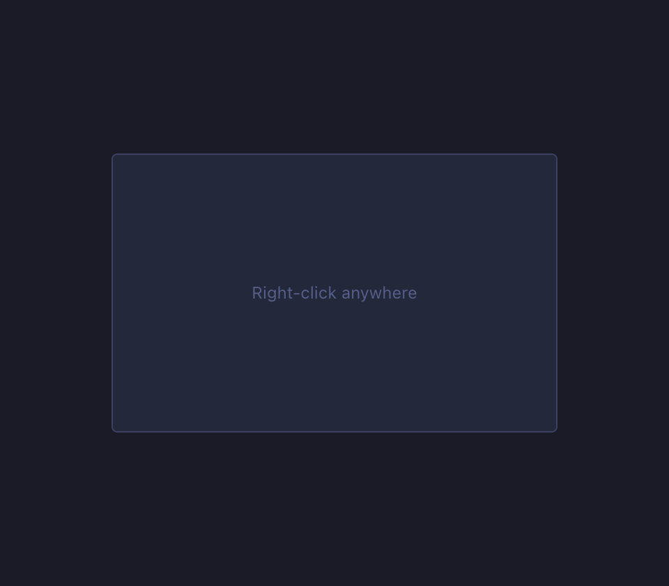</td>
</tr>
<tr>
<td>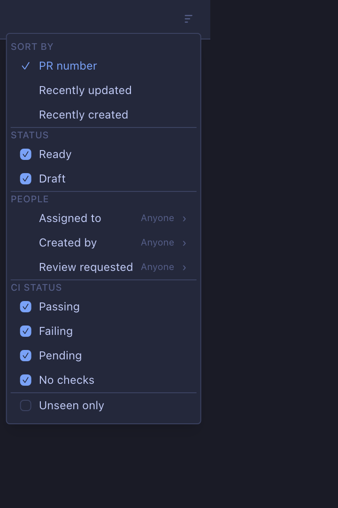</td>
<td>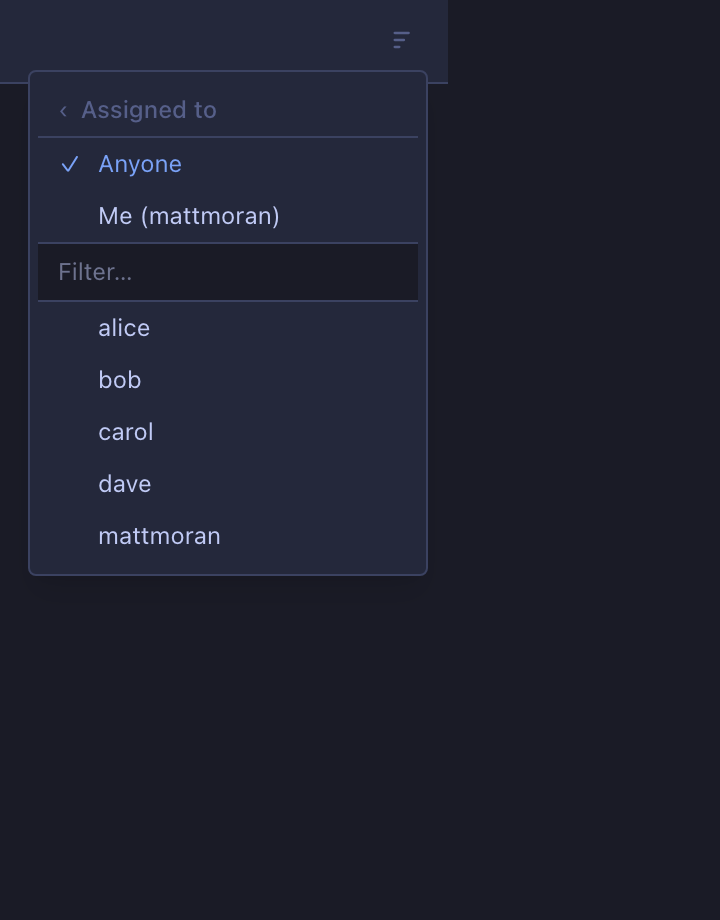</td>
</tr>
<tr>
<td>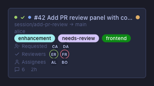</td>
<td>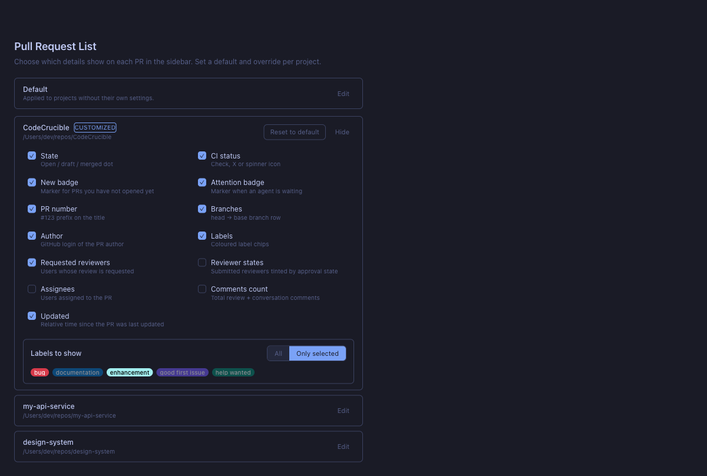</td>
</tr>
</table>

</details>

<details>
<summary><strong>Local PRs</strong></summary>

A **local PR** is a tracked record of a would-be pull request — title, body, branch, base, diff — that lives on your machine *between* a draft branch and an open GitHub PR. You can view and review it like a PR, then **promote** it to a real GitHub PR that pushes those exact details up.

**Producing one (any session)**
- **Create local PR** — from a session's action menu, snapshots its branch/base into a local PR (title/body default from the last commit). The branch is pushed to origin so it's always promotable.
- **Capture mode** — toggle **Capture PRs locally** on a session and the gh shim on its PATH intercepts the agent's `gh pr create`, turning it into a local PR instead of opening a real one. Every other `gh` command passes straight through.

Local PRs appear in the normal PR list with a **Local** badge and a **Promote to PR** button. Promote pushes the branch, opens a real draft PR from the approved title/body/base, and the entry becomes the real PR. Promoting also drops the gh shim for that session (capture mode turns off), so the agent's later `gh` commands act on the real PR instead of being captured into a new local one.

**Foundry overnight stacks.** Turn on **Local PR mode** in a Foundry's settings and an overnight run builds a *chained stack*: the first PR targets the integration branch, each subsequent one targets its predecessor. In the morning, **Create PRs** walks the stack in order — open each real PR, run optional [local CI](#review-loop) in Docker (`act`), fix-on-failure by resuming the worker, mark ready, then the next. The walk is resumable across restarts. The review loop runs against local PRs too, storing its findings on the record instead of posting a gh comment.

See [docs/LOCAL_PRS.md](docs/LOCAL_PRS.md) for the full lifecycle, the captured `gh` commands, and the publish flow.

<table>
<tr>
<td>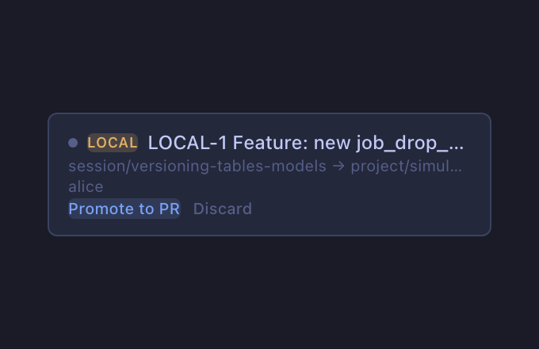</td>
<td>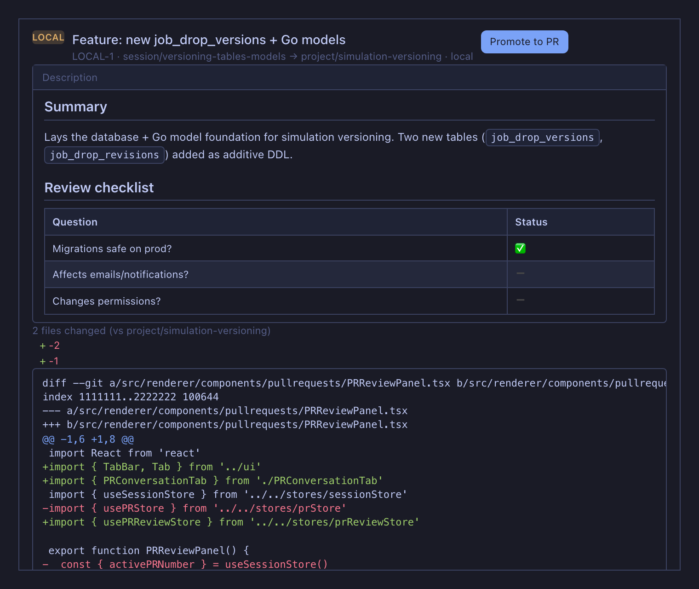</td>
</tr>
</table>

</details>

<details>
<summary><strong>Claude Web sessions</strong></summary>

If you also drive Claude Code from [claude.ai/code](https://claude.com/product/claude-code), this surfaces **your** active web sessions in the sidebar so you can pull them down locally without scrolling through every `claude/*` branch in the repo.

- **Per-project, off by default** — Settings → Claude Web Sessions has an Enable toggle and a Branch prefix (defaults to `claude/`). Nothing renders until you opt in
- **Only your branches** — `claude/*` branches whose latest commit was authored by you. Identity matches against `git config user.email` *or* the GitHub noreply pattern (`<id>+<login>@users.noreply.github.com`) using your `gh` login
- **Hides finished work** — Branches whose PR is merged are excluded automatically; only branches with no PR, an open PR, or a draft PR show up
- **Click to open** — Tap a card to fetch + create the worktree. If the branch is already checked out in the main repo, the conflicting worktree is auto-detached so the new worktree can claim it
- **Stays under Claude Web** — Once opened, the session keeps living under the Claude Web section (not the Sessions list) so the two contexts stay separate
- **Polls every 30 seconds** — Piggy-backs on the existing PR poll; new commits and new sessions appear within ~30 s

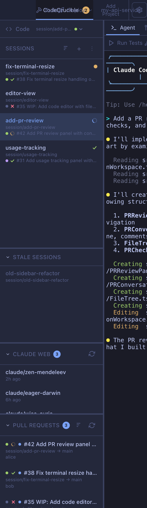
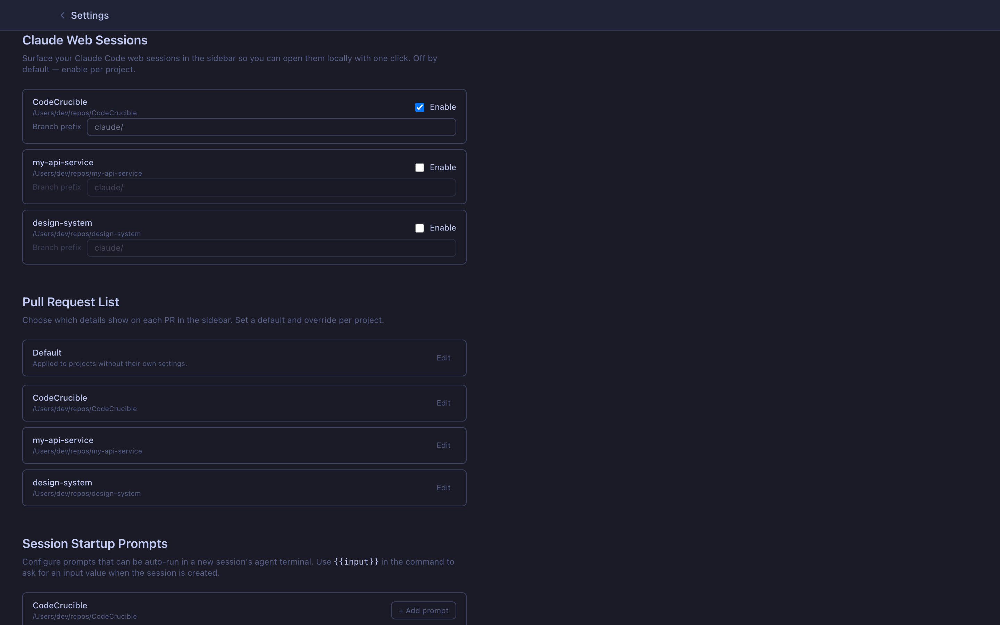
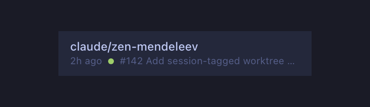

</details>

<details>
<summary><strong>Notion task integration</strong></summary>

Poll a Notion database for new tasks and auto-spawn a session per task. Sessions created this way carry a link back to the originating Notion page so you can jump straight to the ticket from the sidebar.

- **Auto-create sessions** — A poller watches your configured database every ~5 s; new rows matching your filters fire a session with the branch name, session name, and startup prompt resolved from page placeholders
- **OR filter groups** — Define multiple filter groups in the settings UI; a task is picked up if it matches *any* group (groups ORed; conditions within a group ANDed). Useful for "assigned to me in Project A *or* on the urgent list in Project B"
- **Ticket link under branch name** — The session card shows a small ticket icon and the page title beneath the branch. Clicking it hands off to your OS so it opens in the Notion desktop app (if installed) or your default browser — never inside Electron

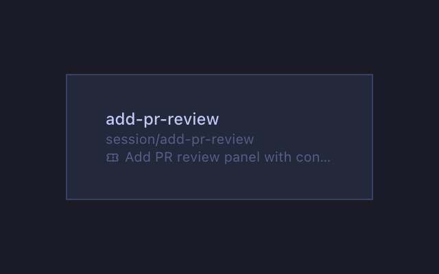

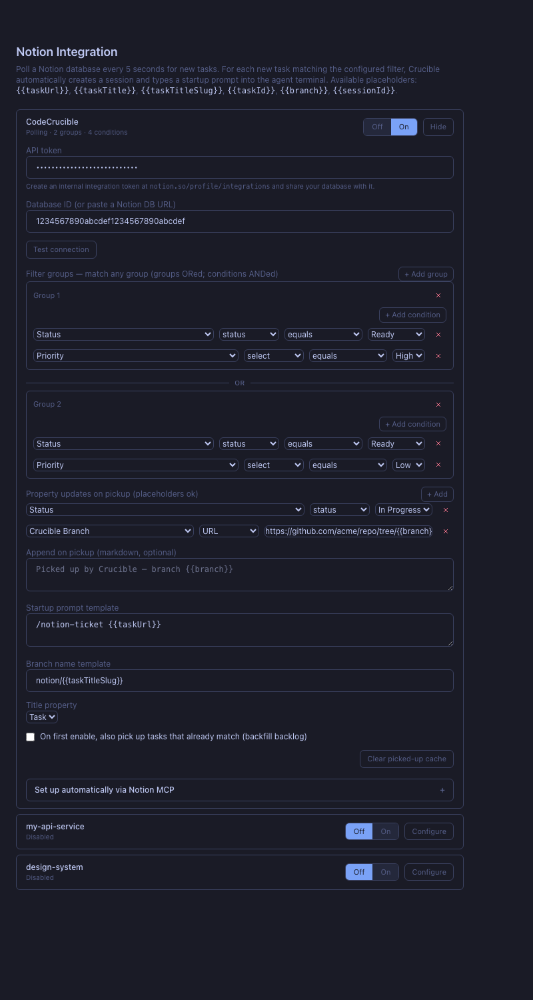

</details>

<details>
<summary><strong>Notifications & intervention detection</strong></summary>

Detects when Claude Code needs user input by scanning terminal output for permission prompts and questions.

- **Desktop notifications** — OS-level notifications when Claude needs attention
- **Dock badge** — macOS dock badge shows count of sessions needing input
- **Session status indicators** — Sidebar icons show running (spinner), attention (yellow dot), completed (green check)
- **Auto-clear** — Attention state clears when you navigate to the session
- **Cross-project** — Notification badges appear on project tabs for non-active projects too

</details>

<details>
<summary><strong>Usage tracking</strong></summary>

Monitor Claude Code usage and rate limits from the right panel.

- **Rate limit bars** — 5-hour and 7-day usage windows with visual progress bars
- **Session stats** — Cost, duration, lines added/removed per session
- **Activity chart** — Daily activity over the past week (messages, sessions, tool calls)
- **Subscription info** — Shows your current plan and rate limit tier
- **Auto-continue on limit** — When a session or agent actually hits its usage limit, a popup offers to queue a follow-up prompt that fires automatically once the window resets. The trigger watches the terminal for Claude's real "usage limit reached" banner — the message that genuinely blocks a conversation — not a usage percentage, so accounts with no hard limit (overage/extra usage) never mis-fire. Opt into Settings → Usage Limits to skip the popup and auto-queue `continue` for you

</details>

<details>
<summary><strong>Code editor</strong></summary>

Built-in code editor for when you need to make quick edits without switching apps.

- **CodeMirror 6** — Language support for JavaScript, TypeScript, Python, CSS, HTML, JSON, and Markdown
- **Code folding** — Fold-gutter chevrons let you collapse functions, classes, and any other foldable region; `Cmd-Alt-[` / `Cmd-Alt-]` keymap supported
- **File explorer** — Directory tree for any worktree, with file watching for external changes
- **Right-click context menu** — Open, copy relative/absolute path, reveal in Finder, delete file
- **Create and rename** — Create new files, rename existing ones from the explorer
- **Toggle mode** — Switch between editor view and terminal view from the workspace
- **Branch picker** — Click the branch label next to **Code** in the sidebar to search and switch branches. Branches with open PRs show a `#N` badge and a status dot (open / draft / merged). Switching with uncommitted changes prompts to either stash them or carry them onto the new branch.
- **Worktree tab** — The same commit log + working changes + diff viewer the session worktrees get, but pointed at the main repo so you can dig through history and uncommitted changes for whichever branch you have checked out.

<table>
<tr>
<td>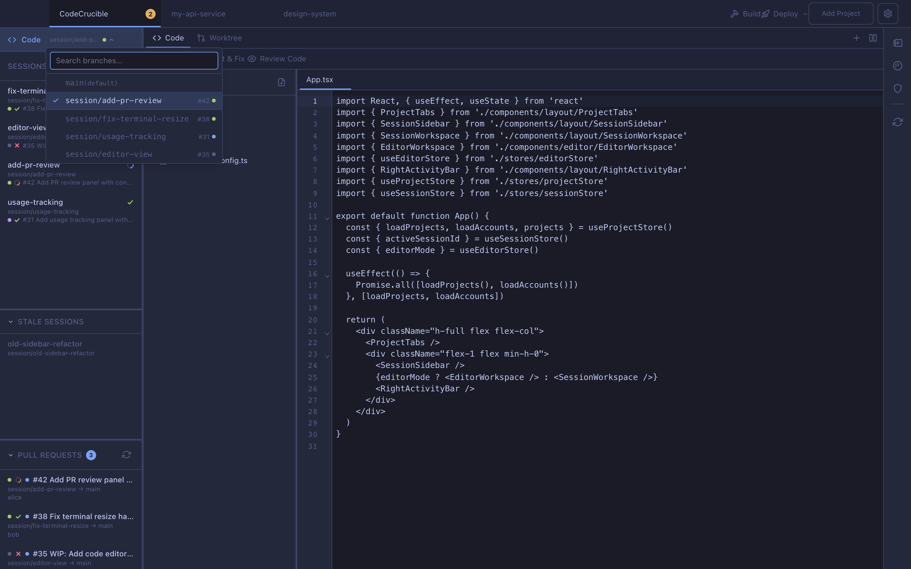</td>
<td>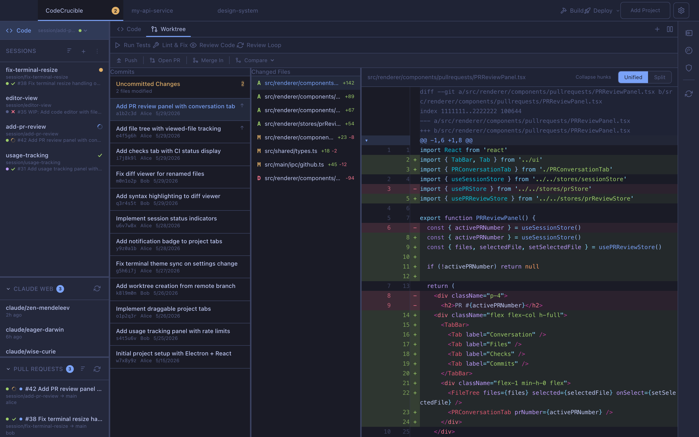</td>
</tr>
</table>

</details>

<details>
<summary><strong>Notes</strong></summary>

Per-project notes panel accessible from the right activity bar.

- Create, edit, and delete markdown notes
- Useful for tracking session goals, review checklists, or project context

</details>

<details>
<summary><strong>Custom buttons</strong></summary>

Create configurable action buttons that run shell commands or Claude prompts from anywhere in the IDE.

- **Three placements** — Session toolbar, top project bar, or right activity bar
- **Two action types** — Shell commands or Claude prompts with template variable substitution (`{{branch}}`, `{{worktreePath}}`, `{{sessionName}}`, `{{repoPath}}`, `{{projectName}}`)
- **Two execution modes** — Background (silent with toast notification on completion) or terminal (interactive with live output)
- **Button groups** — Organize related buttons into dropdown menus
- **Scope control** — Global, all projects, or specific projects only
- **Keyboard shortcuts** — Assign Electron accelerator shortcuts (e.g. `Cmd+Shift+T`)
- **Confirmation dialogs** — Optional confirmation prompt before executing destructive actions
- **Icon picker** — 35+ built-in Lucide icons plus custom emoji support

</details>

<details>
<summary><strong>Review loop</strong></summary>

Automate the review → triage → fix cycle on a branch. There are three variants, chosen per project in **Settings → Review Loop** — **Lite**, **Pro**, and **Efficient**.

**Lite and Pro** run each round as three phases — Review, Triage, Implementation — in one of two run modes:

- **Headless (`-p`, the default)** — each phase runs as a background `claude -p` process with **no pseudo-terminal**, and the panel streams its transcript read-only. Because it uses no PTY, you can run many loops at once without hitting the macOS pseudo-terminal limit. It runs in your normal auto permission mode — never `--dangerously-skip-permissions` and never `--permission-mode acceptEdits`.
- **Interactive** — each phase opens a live Claude Code terminal side by side that you can watch and type into in real time, so you can step in and steer it whenever you want.

1. **Review** — A Claude terminal reviews the diff vs. base. In the Pro variant it writes structured findings to `.crucible/review-loop/round-N-issues.json`; in Lite it runs `/review` on the PR.
2. **Triage** — A second Claude terminal reads those findings and fans out a sub-agent per issue. Each sub-agent decides `fix` / `skip` / `defer` / `noop` and writes a short justification.
3. **Implementation** — A third Claude terminal applies the fixes, commits, and pushes.

In interactive mode each phase advances when its turn finishes (detected via Claude's `Stop` hook), then **freezes with a read-only "Completed" overlay** so its output stays readable but can't be edited; in headless mode the phase ends when the `claude -p` process exits. Either way the next phase starts in a fresh column, and every round opens a new row of three columns — so the whole history of a loop stays on screen.

**Efficient** is a token-frugal variant with a fixed two-panel topology. A *fresh* review genuinely benefits from clear, unbiased context every round, but triage and implementation don't — so it spends fresh context only where it matters:

- **Left** — a fresh, headless `claude -p` **review** per round, stacked newest-first. Clear context every round keeps each review honest.
- **Right** — **one long-lived, interactive worker** terminal that triages then implements for *every* round, keeping its conversation across the whole loop. Because it remembers earlier rounds, it won't re-litigate issues it already deliberately skipped or deferred. Round 1's review is handed to it at spawn; later rounds' reviews are pasted into the live session, and each turn advances on the worker's `Stop` hook.

This trades three fresh sessions per round (Lite/Pro) for one fresh review plus a persistent worker — much cheaper over a multi-round loop, with better continuity. The run-mode toggle doesn't apply (the topology is fixed); convergence is the same as Lite (a round with no new commit is "clean").

The loop stops on the first of: N consecutive clean rounds (default 2), iteration cap (default 5), or manual cancel. Phase terminals are swept when a loop finishes, when a new loop starts for the session, and when the session is closed, so PTYs never accumulate toward the macOS limit. Workspace defaults and per-project overrides live in **Settings → Review Loop**, including the headless/interactive run-mode toggle and a per-project toggle that hides the toolbar button and prevents the loop from running for that scope.

Skipped or deferred items get summarised in a single sticky comment on the open PR (using a hidden marker so subsequent rounds update the same comment instead of re-posting). That gives reviewers a record of what was knowingly left undone and why.

The Review Loop tab in the session workspace shows live progress: an overall status pill and current phase. In Lite/Pro that's three columns per round with their own status pills (each either a live terminal or a streamed headless transcript), per-round triage decisions, and a per-round log. In Efficient it's the two-panel layout instead — the stack of fresh reviews on the left and the single persistent worker terminal on the right.

<table>
<tr>
<td>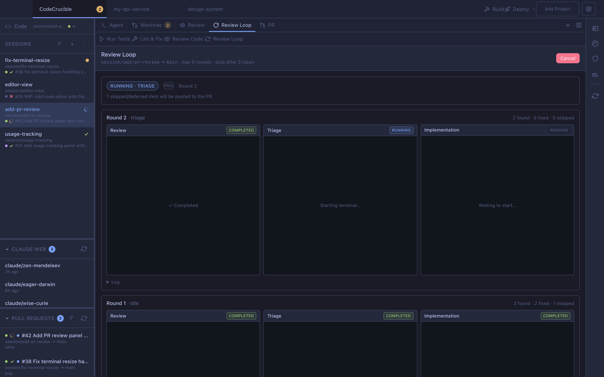</td>
<td>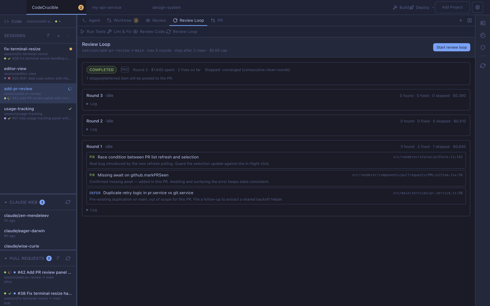</td>
</tr>
<tr>
<td>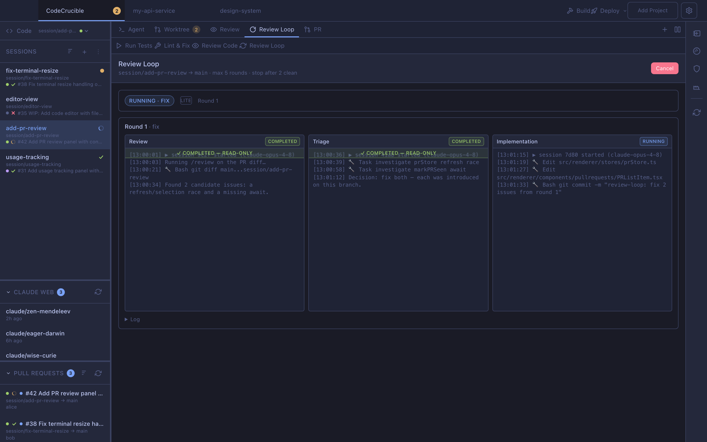</td>
<td>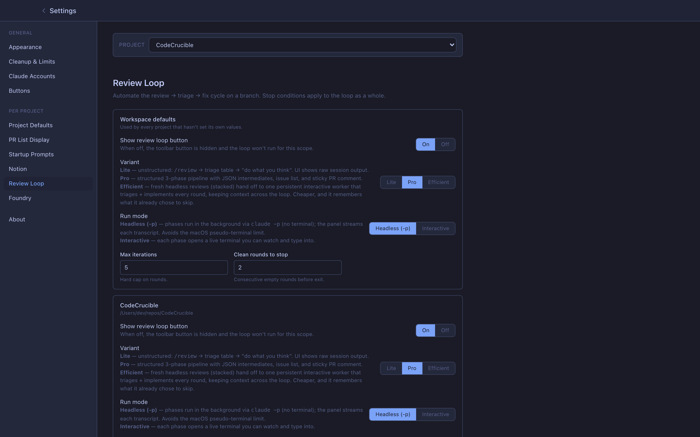</td>
</tr>
</table>

</details>

<details>
<summary><strong>Foundry — autopilot over a Notion backlog</strong></summary>

The next layer above the [single-ticket Notion integration](#notion-task-integration). Where the Notion poller turns one Notion row into one Claude session, the **Foundry** turns an *entire backlog* into a planned, dependency-aware stream of work — sessions, draft PRs, review loops, finalisation, all coordinated. The human reviews code and tests. Foundry does everything else.

**The two-brains design.** Every Foundry runs two distinct decision-makers against the same budget:

- **Foreman** — a real, interactive Claude session you can watch and nudge. Reads the entire task set + your codebase, infers dependencies between tickets, picks which tickets to start *next and in what order*. It doesn't write code; it writes a `decision.json` that the pipeline FSM executes.
- **Pipeline FSM** — pure TypeScript in the main process. Validates the foreman's decision (drops unknown page ids, caps concurrency, sanitises branch names), then drives each picked task through `spawn-requested → implementing → reviewing → finalizing → done`. Doesn't make decisions; just executes them.

The LLM can suggest anything (start 50 tasks! re-document the same plan!). The validation layer is the safety boundary. The LLM's authority over real-world side effects is exactly zero — it writes a file; the FSM decides what's executable.

**Pipeline phases.**

- `spawn-requested` — apply Notion pickup updates (e.g. `Status: Not Started → In Progress`), ensure the base branch exists (auto-create + push off the repo default if not), tell the renderer to materialise a worktree + Claude session.
- `implementing` — poll `gh pr list --head <branch>` every 15s. Worker session is responsible for committing, pushing, and opening its own draft PR. Stop-hook hints opportunistically check on each turn-completion. Timeout (default 60m) parks the pipeline as attention.
- `reviewing` — kick off the [Lite Review Loop](#review-loop) against the freshly-opened draft PR. Foundry subscribes to its state-update bus and advances when it converges.
- `finalizing` — inject your ready-for-review prompt into the worker's **existing** PTY (bracketed-paste escape sequences so multi-line content goes in as one paste), wait for verified completion (PTY buffer must grow by ≥200 bytes to filter stale stop events), then `verifyPRReady` against `gh`. If your prompt didn't mark the PR ready, the pipeline parks with attention rather than silently overriding you.
- `done` — slot frees → another foreman pass fires automatically.

**Trigger ladder.** A foreman pass fires on snapshot-diff transitions (20s tick + 5s debounce), slot-freed events, manual "Run pass" clicks, the off→on toggle, app startup, and a 10-minute safety-net cron regardless. Snapshot detection is actor-agnostic — a human moving the ticket, a Notion automation, a Linear sync, whatever — we just notice the value changed.

**Optimistic continue.** A per-foundry toggle (default off) for when human PR review is the bottleneck. Normally a dependency only unblocks the next ticket once it's merged to trunk (a *completed status* like `Done`/`Testing`). Turn this on and dependencies in an **optimistic status** (default `In review` — PR open, not yet merged) also count: the foreman picks up the next ticket they unblock, and the FSM prepends a deterministic `git merge origin/<dep-branch>` preamble to the worker's prompt so the prerequisite code is merged in before implementation starts. If a dependency's branch can't be resolved, the pipeline parks for attention instead of starting work that's missing code. Safe to toggle while running — it takes effect on the next pass. See [docs/FOUNDRY.md](docs/FOUNDRY.md#optimistic-continue).

**Switching between foundries.** A project can run more than one foundry at once. When it does, the foundry name in the panel header becomes a dropdown switcher — open it to see every foundry with a live status dot (running / pass-in-flight / needs-attention / paused / off), a one-word status, and a badge counting its in-flight pipelines. Pick one and its pipelines and foreman pane fill the panel below. With a single foundry the header is just the name.

**Live foreman PTY in the panel.** The Foundry side panel pins a real `claude` PTY in its bottom 320 px while a pass is running. You watch the foreman think in real time; type into it to nudge it; when it writes `decision.json` the PTY closes automatically. Between passes the pane falls back to the previous pass's transcript (read-only).

**Reset.** The card has a Reset button when the foundry is off — wipes pipelines, pass history, snapshot, documented hashes; keeps the config. Useful when state has drifted from reality.

<table>
<tr>
<td>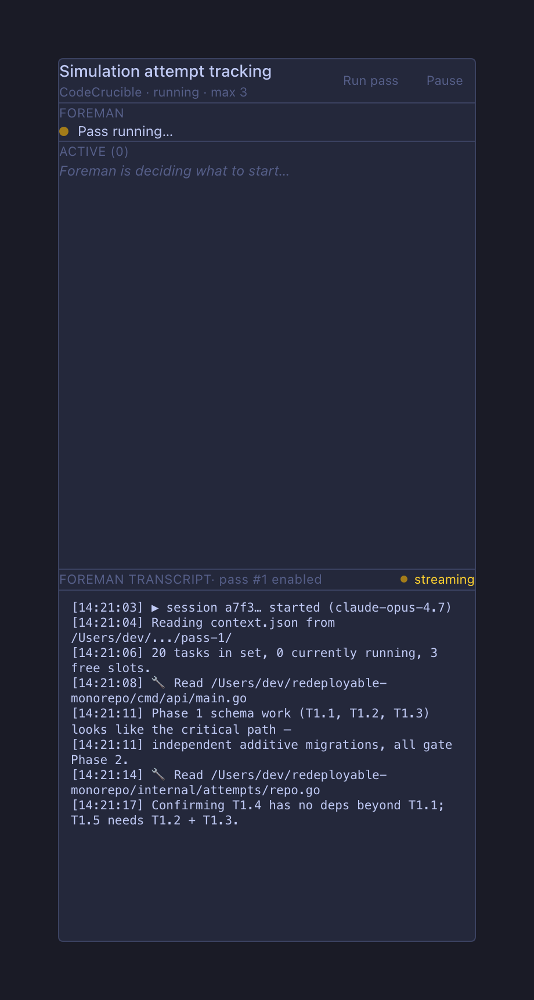</td>
<td>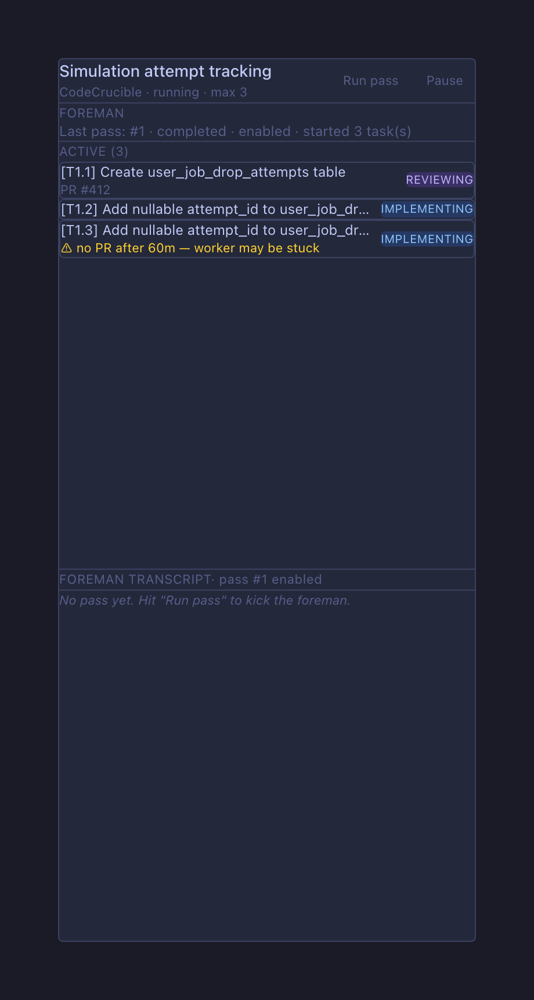</td>
</tr>
<tr>
<td>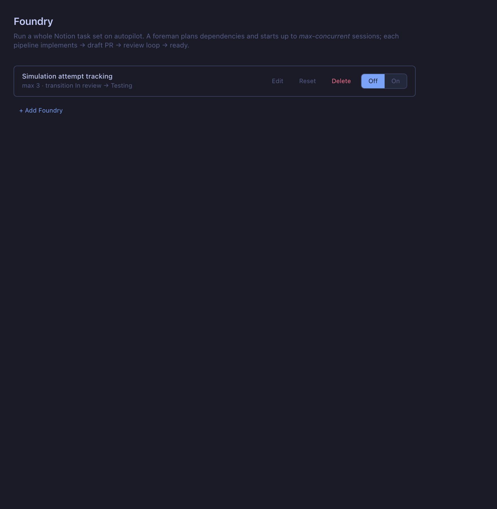</td>
<td>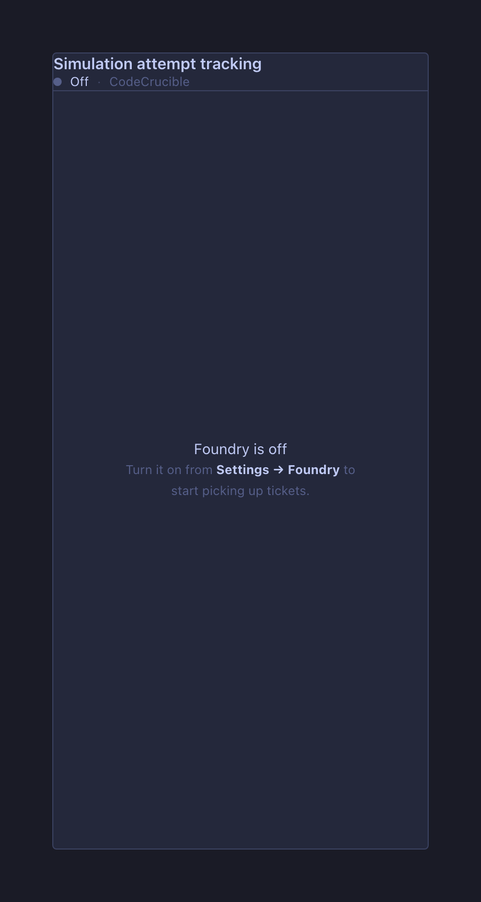</td>
</tr>
<tr>
<td colspan="2">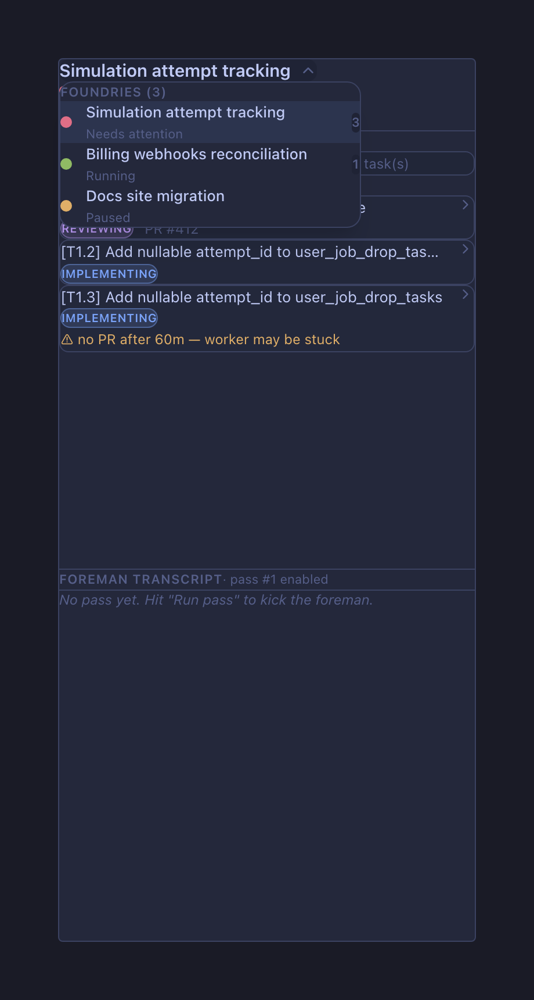</td>
</tr>
<tr>
<td colspan="2">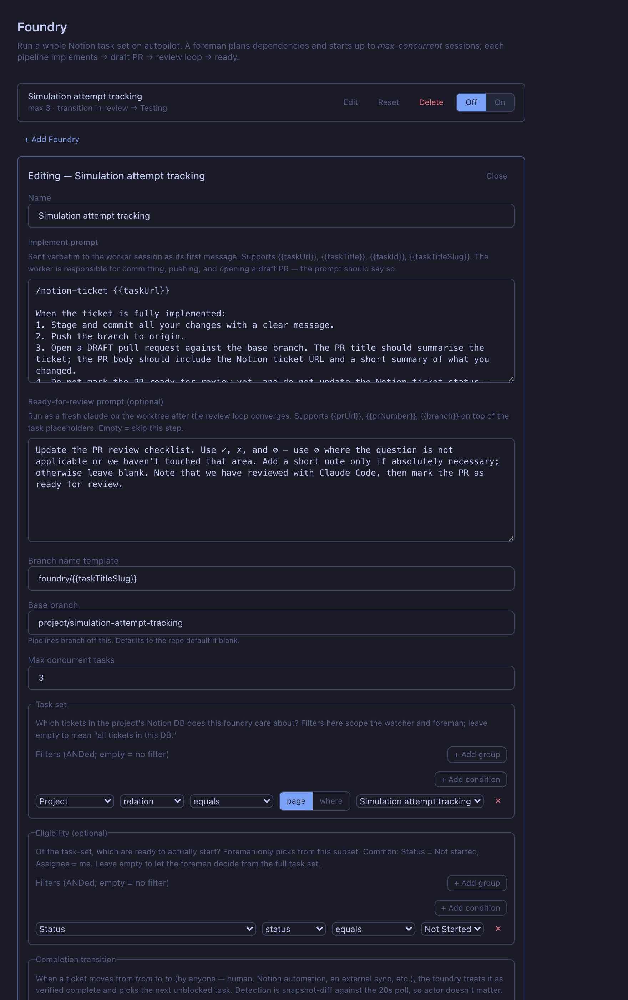</td>
</tr>
</table>

Full architecture, the foreman decision contract, validation rules, every failure mode, and source pointers are in [docs/FOUNDRY.md](docs/FOUNDRY.md).

</details>

<details>
<summary><strong>Permissions sync</strong></summary>

View and edit Claude Code permissions (allow/deny lists) from the right panel.

- Changes sync across all worktrees for the project
- See which tools and commands are allowed or denied at a glance

</details>

<details>
<summary><strong>Architecture</strong></summary>

Three-layer Electron architecture with strict process isolation:

```
src/
├── main/            # Electron main process (Node.js)
│   ├── ipc/         # IPC handlers (one file per domain)
│   └── services/    # Business logic (git, worktree, terminal, notification)
├── preload/         # contextBridge — typed API on window.api
├── renderer/        # React UI (no Node.js access)
│   ├── components/
│   │   ├── ui/           # Base components (Button, Dialog, ListBox, TabBar, etc.)
│   │   ├── layout/       # App shell (ProjectTabs, SessionSidebar, SessionWorkspace)
│   │   ├── sessions/     # Session management (SessionCard, CreateSessionDialog)
│   │   ├── git/          # Git viewer (CommitList, ChangedFiles, DiffViewer)
│   │   ├── terminal/     # Terminal (TerminalPanel, DynamicTerminalPanel)
│   │   ├── editor/       # Code editor (CodeEditorPanel, FileExplorer)
│   │   ├── buttons/      # Custom buttons (CustomButtonBar, ButtonRenderer, IconPicker)
│   │   ├── pullrequests/ # PR review (PRReviewPanel, PRConversationTab, FileTree)
│   │   ├── notes/        # Notes panel
│   │   ├── usage/        # Usage tracking panel
│   │   └── permissions/  # Permissions panel
│   ├── stores/      # Zustand state (14 stores)
│   ├── hooks/       # Shared hooks (useResizable, useFocusTrap, useRovingIndex)
│   └── styles/      # Tailwind + CSS custom property themes
└── shared/          # Types, constants, patterns shared across processes
```

### Tech stack

- **Runtime**: Electron 33 (main + renderer)
- **UI**: React 19, TypeScript, Tailwind CSS 4
- **Build**: electron-vite 5, Vite 8
- **State**: Zustand (14 stores)
- **Terminal**: xterm.js + node-pty
- **Git**: simple-git
- **Syntax highlighting**: Shiki
- **Code editor**: CodeMirror 6
- **Markdown**: marked

### IPC

All communication between renderer and main process goes through typed IPC channels defined in `src/shared/constants.ts`. The renderer has no Node.js access — it communicates exclusively via `window.api`, exposed by the preload script with `contextIsolation: true`.

### Stays awake while running

So long-running work — terminals, Claude sessions, review loops, the [Foundry](#foundry--autopilot-over-a-notion-backlog) and the remote relay — keeps running when you lock the screen and walk away, the app prevents the Mac from sleeping for its entire lifetime. It holds an Electron `powerSaveBlocker` of type `prevent-app-suspension` (started on launch, released on quit, re-armed after a forced sleep/resume), so the *system* stays awake while the *display* is still free to turn off when the screen locks. See `src/main/services/keep-awake.service.ts`. No setting — it's always on while the app is open.

</details>

<details>
<summary><strong>Theming</strong></summary>

Four built-in themes: **Dark** (Tokyo Night, default), **Light**, **Soft Light**, and **Ultra Dark**.

Themes are defined as CSS custom properties in `src/renderer/styles/globals.css`. Tailwind utilities reference these properties via the `@theme` block, so switching themes is instant and all components respond automatically.

Terminal colors sync with the app theme. The Claude Code CLI theme (light/dark) can be configured separately in settings.

To add a custom theme, add a `[data-theme="your-theme"]` block with the same property names:

```css
[data-theme="your-theme"] {
  --color-bg: #...;
  --color-text: #...;
  --color-accent: #...;
  /* see globals.css for the full list */
}
```

</details>

<details>
<summary><strong>Keyboard shortcuts</strong></summary>

| Key | Action |
|-----|--------|
| Arrow Up/Down | Navigate lists (sessions, commits, files) |
| Arrow Left/Right | Navigate tabs |
| Enter / Space | Activate selection |
| Escape | Close dialogs, settings, panels |
| Tab | Standard focus navigation |

All interactive elements use `focus-visible` rings — visible on keyboard navigation, hidden on mouse clicks.

</details>

## Contributing

See [CONTRIBUTING.md](CONTRIBUTING.md). The short version: PR descriptions should explain the **intent and prompt** behind the change, not just the code. Features are accepted based on whether the aim fits the project.

## License

[MIT](LICENSE) — do whatever you want with it.
