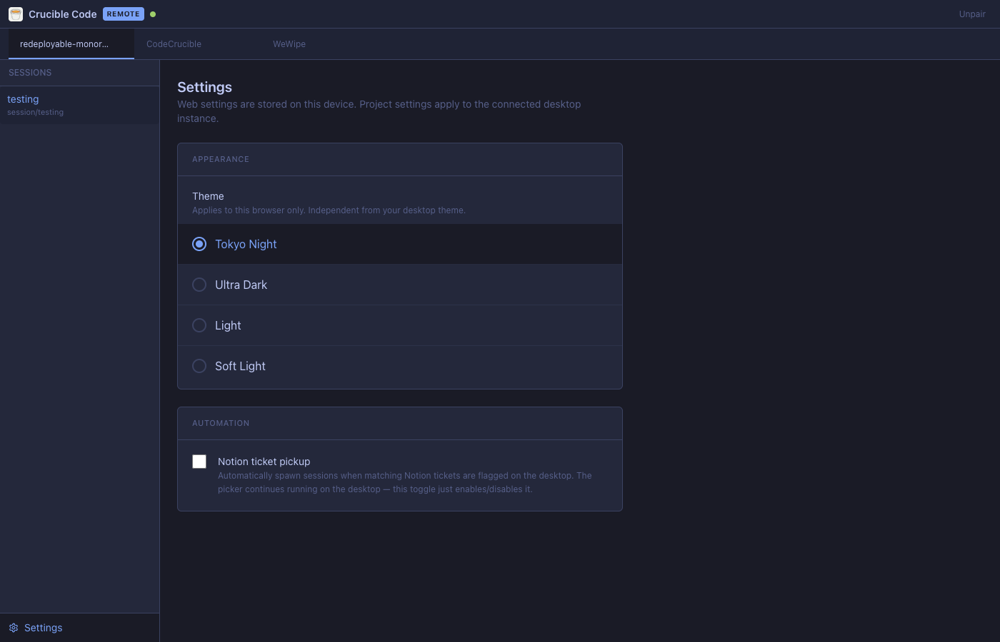
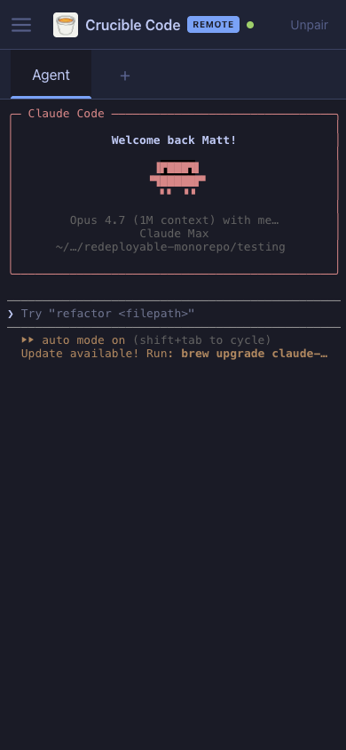

# Remote access

CodeCrucible can serve its projects, sessions, settings, and live agent terminals to any browser on the same LAN. The desktop instance hosts both an HTTP/WebSocket relay and the receiver app served as static files — no external server.

## At a glance




Mobile layout:

| Drawer | Session | Settings |
| --- | --- | --- |
|  |  |  |

## Enabling it

1. In the desktop top bar, click **Remote**.
2. Toggle the popover **On**. The dot turns green when the relay is bound.
3. The popover shows one or more LAN URLs (e.g. `http://192.168.0.13:7878/`) and a 6-character pairing code.
4. On the other device, open the URL in a browser, enter the code, give the device a label, and submit. A long-lived token is stored in `localStorage` so subsequent visits skip the pairing screen.
5. To revoke devices, hit **Revoke all** in the desktop popover.

## What's in scope (v1)

- **Projects** — list, switch active project.
- **Sessions** — list per project, open a session, see its currently running terminals (Agent, Review, additional shells), attach to them with backfill of the recent output, stream new output, and type input.
- **Settings** — functional settings that drive automation. Today this is the per-project Notion ticket-pickup toggle and the receiver's own theme. Settings UI for UI-only desktop preferences (e.g. window layout) is deliberately not exposed remotely.
- **Web theme** — independent from the desktop. Picked in **Settings → Appearance**, persisted in `localStorage` under `codecrucible-remote-theme`. Same four themes the desktop ships.

## Out of scope (v1)

- Pull request review
- Claude-for-Web flows
- Repo cloning to the remote machine
- Env-var / secrets sync
- Multiplexing reads-only access (everyone with a token has full control)

## Architecture

```
┌───────────────────────────────┐
│ Desktop Electron app          │
│                               │
│  main:                        │
│   ├ ipcMain.handle  ─┐        │
│   │   (renderer ipc) │        │
│   │              handlerMap   │   ┌────────────────────┐
│   │                  │        │   │ Browser receiver   │
│   ├ relay-server.ts ─┘──── ws─┼───┤  React + xterm.js  │
│   │   /            static     │   │  wsClient shim:    │
│   │   /pair        POST       │   │   api.projects.* etc│
│   │   /ws          upgrade    │   │   on('term:data') │
│   │                           │   └────────────────────┘
│   └ event-bus.ts ────────────┐│
│                              ││
│  monkey-patched               │
│  mainWindow.webContents.send ─┘
│                               │
└───────────────────────────────┘
```

### Modules

| Path | Responsibility |
| --- | --- |
| `remote/protocol/messages.ts` | Discriminated union of WebSocket frames (`req`, `res`, `evt`, `subscribe-session`) plus binary opcodes scaffolded for the future hot-path. |
| `remote/protocol/channels.ts` | Re-exports `IPC` channel names so the receiver's `window.api`-style shim uses the same identifiers as the renderer. |
| `remote/server/relay-server.ts` | Bootstraps an `http.Server` + `WebSocketServer`. Serves the built receiver from `remote/receiver/dist/`. Authenticates the WS upgrade via `?token=…`. |
| `remote/server/pairing.ts` | In-memory 6-char base32 pairing code, 5-minute TTL, single-use. |
| `remote/server/auth.ts` | Long-lived tokens persisted in `electron-store` (file: `remote-devices.json`). |
| `remote/server/bridge.ts` | One per WS client. Inbound `req` frames dispatch through `src/main/ipc/handle.ts#invokeHandler`. Outbound: subscribes to every `IPC.*` channel on the event bus and forwards as `evt` frames. |
| `src/main/ipc/handle.ts` | `handle(channel, fn)` registers a handler with both `ipcMain.handle` and a shared `handlerMap`. Used everywhere `ipcMain.handle` used to be called. |
| `src/main/services/event-bus.ts` | Tiny `EventEmitter` for IPC channels. Fed automatically by a monkey-patch on `mainWindow.webContents.send` in `src/main/index.ts`, so existing call sites (terminal output, notifications, settings writes, etc.) reach the relay with zero edits. |
| `remote/receiver/` | Vite + React app. Same color tokens and `globals.css` as the desktop renderer; reuses `Sidebar` / `SidebarSection` / `Button` / `Input`. |

### Protocol

```ts
type Frame =
  | { kind: 'req'; id: string; channel: IPCChannel; args: unknown[] }
  | { kind: 'res'; id: string; ok: true;  result: unknown }
  | { kind: 'res'; id: string; ok: false; error: string }
  | { kind: 'evt'; channel: IPCChannel; args: unknown[] }
  | { kind: 'subscribe-session'; sessionId: string }
  | { kind: 'unsubscribe-session'; sessionId: string }
```

All control + RPC traffic is JSON. Binary frames (opcodes 0x01 data, 0x02 resize) are reserved for a future v2 terminal hot path — see `remote/protocol/messages.ts`.

### Terminal attach + backfill

The desktop's `terminal.service` keeps a per-terminal rolling tail (`buffer: string`, cap 64 KiB) updated inside the PTY `onData` callback. When the receiver opens a session it calls:

1. `IPC.TERMINAL_LIST_FOR_SESSION` → returns one entry per workspace tab (deduplicated by `tabId`; orphan duplicates from misuse are killed on the spot).
2. `IPC.TERMINAL_GET_BUFFER` per `terminalId` → returns the tail, which is `term.write()`-ed into xterm before the live stream subscription kicks in.
3. Subscribes to `IPC.TERMINAL_DATA` and filters by `terminalId`.

`spawnTerminal` is idempotent on `(sessionId, tabId)`: if a live terminal already owns that workspace tab, the existing id is returned. This prevents the remote and desktop from binding to different PTYs for the same tab.

### Cache-Control

`index.html` is served with `Cache-Control: no-store, must-revalidate`. Hashed asset bundles (`/assets/*.js`, `*.css`) get `public, max-age=31536000, immutable`. New builds are picked up immediately on reload; assets are cached for a year.

## Settings sync

Functional settings flow through the same `handlerMap` whether written from the renderer or the relay. Settings writes that should propagate to other clients emit a corresponding event through the event bus — for example, `IPC.NOTION_CONFIG_LOAD` is re-emitted on save in `src/main/ipc/notion.ipc.ts`. Both the desktop renderer's settings store and the receiver subscribe to it.

## Testing

- Unit: `tests/unit/remote/` — covers pairing generation/consume/expiry and the receiver components (`ProjectTabs`, `SessionSidebar`, `ThemeRadioList`, `MobileNav`). Run via `npm run test:unit`.
- Manual: enable the relay, open the LAN URL on a second device, type in the terminal on each, and verify both echo the same characters.

## Known v2 work

- Binary framing + node-pty `pause()/resume()` for backpressure (scaffolded in `protocol/messages.ts` but not wired).
- Ring-buffer replay with sequence numbers so a reconnect can ask for a screen redraw without ANSI corruption.
- Pull-request review surface on the receiver.
- Sensitive-action confirmation flow (today any paired device can do anything the desktop can).
